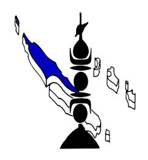

<a href="https://data.gouv.nc/explore/dataset/avis-de-vacances-de-poste-avp-drhfpnc/files/d9251e1fd46b88a17756c1369aa9cf83/download/" target="_blank" style="display: inline-block; padding: 8px 16px; background-color: #3f51b5; color: white; text-decoration: none; border-radius: 4px;">📄 Télécharger le PDF original</a>

**Agent d'entretien - Ambulancier (Touho)**

**Référence : 3134-26-0606/SR du 24 avril 2026**

**Employeur : Province Nord**

**Corps ou Cadre d'emploi / Domaine :** ACDP – grille 1

**Durée de résidence exigée pour le recrutement sur**

**titre (1) :** /

**Poste à pourvoir :** à compter du 01/01/2027 **Lieu de travail :** TOUHO

**Date de dépôt de l'offre :** Vendredi 24 avril 2026

**Date limite de candidature :** Vendredi 15 mai 2026

## Détails de l'offre :

La Direction des Affaires sanitaires, Sociales, de la Prévention et de la Solidarité est organisée en 4 pôles (administration générale, Solidarité, Prévention et promotion de la santé, Soins), 8 services et 14 bureaux. La DASSPS comprend 242 agents. La coordination générale des activités du centre médico-social de TOUHO est assurée par le chef de Bureau de Proximité de Soins Côte Est. Ce bureau est rattaché au pôle soins de la direction

**soins Côte Est.**

**Emploi RESPNC** : Ouvrier entretien

**Missions :**

Placé sous l'autorité du chef de bureau de proximité de soins Côte Est (BPS Côte Est), l'ouvrier d'entretien polyvalent effectue les travaux dans un ou plusieurs corps de métiers du bâtiment en suivant des directives ou d'après des documents Techniques. II assure la gestion, l'entretien et la maintenance des véhicules en relation avec le « PARKOTO » d'affectation de la collectivité de la province-Nord. II assure aussi l'entretien des espaces verts

**Activités principales :**

## **La personne retenue aura notamment en charge :**

#### Ouvrier d'entretien

- Entretien et maintenance des bâtiments et équipements (groupes électrogènes, Climatiseurs, cuve à eau, ...) ;
- Réalisation de petits travaux d'aménagement et de réparation des bâtiments rattachés à la structure (centre médico-social, logements de passage, mobiliers) ;
- Diagnostic et contrôle des équipements (groupes électrogènes, climatiseurs, ...) ;
- Gestion des matériels et produits nécessaires à ses interventions ;
- Entretien des espaces verts des bâtiments rattachés à la structure (Centre Médico-

Social et logements de passage) ;

- Assurer les diverses manutentions liées au fonctionnement de la structure (livraisons diverses, montage de matériel, gestion des déchets notamment DASRI) ;
- Entretien, maintenance et gestion des véhicules en relation avec le « PARKOTO » d'affectation de la collectivité de la provin -Nord ;
- Participation à l'acheminement de patients, du personnel, du matériel, des médicaments.

### **Activités secondaires :**

### Ambulancier :

- Participation à la permanence (en journée) et l'astreinte (nuit, jour férié et week-end) ambulancière d'urgence
- -Entretien, maintenance et gestion des véhicules en relation avec le parkoto d'affectation

**Direction : Direction des affaires sanitaires et sociales, de la prévention et de la solidarité (DASSPS) – Pôle Soins – Centre médico-social de TOUHO / Bureau de proximité de**

#### **La personne retenue aura également en charge :**

- Participer au renfort logistique des actions locales ponctuelles ;
- Être une personne ressource dans la gestion des violences ou conflits avec la population.

#### **Caractéristiques particulières de l'emploi :**

/

## **Savoir / Connaissance/Diplôme exigé :**

## **Savoir :**

### Ouvrier d'entretien :

#### - **Être titulaire du permis de conduire B**

- Techniques du bâtiment de second d'œuvre : maçonnerie, électricité, plomberie, peinture ;
- Fonctionnement des différents types d'outillage ;
- Règles d'hygiène et sécurité ;
- Notion de sécurité et de risques pour le public ;
- Techniques de débroussaillage et de désherbage ;
- Techniques de signalisation ;
- Notions de mécanique auto.
- Notions en informatique (Outlook, Word, Excel...)

#### Ambulancier :

- Soins d'urgence
- **Être titulaire du diplôme d'ambulancier**
- Techniques de manutention des malades
- Hygiène hospitalière

### **Savoir-faire :**

### Ouvrier d'entretien

- Lire et comprendre un plan simple ;
- Maintenir en état les matériels et outils ;
- Appliquer et respecter des règles et des normes ;
- Détecter les dysfonctionnements dans un bâtiment, du matériel ou un véhicule ;
- Diagnostiquer la limite dans la réalisation d'un travail au-delà de laquelle l'appel d'un spécialiste est indispensable ;
- Coordonner l'intervention avec d'autres corps de métiers ;
- Organiser les activités selon les circonstances climatiques, techniques, matérielles.

#### Ambulancier :

- Désinfecter le matériel selon les protocoles de nettoyage et de décontamination
- Adapter la conduite du véhicule sanitaire à l'état du patient
- Réparer une panne simple sur le véhicule
- S'orienter et choisir un itinéraire

## **Comportement professionnel :**

- Rigueur et vigilance ;
- Capacité à hiérarchiser les priorités, de rendre compte ;
- Respect de la confidentialité ;
- Rigueur dans le respect des normes et des consignes ;
- Sens du travail en équipe ;
- Sens de l'organisation ;
- Esprit d'initiative ;
- Autonomie.

#### **Contact et informations complémentaires :**

Pour tout renseignement complémentaire, vous pouvez contacter **Madame Jessica WADRENGES, Cheffe de bureau de proximité de soins de la Côte EST, Direction des affaires sanitaires et sociales, de la prévention et de la solidarité (DASSPS)**- Tél : 47.72.30/ 76.08.89. **Mail** : [j.wadrenges@province-nord.nc](mailto:j.wadrenges@province-nord.nc) ou dassps-srh@province-nord.n.

Vous pouvez consulter l'ensemble des AVP sur le site de la DRHFPNC ([www.drhfpnc.gouv.nc](http://www.drhfpnc.gouv.nc)) ainsi que la réglementation et le répertoire des emplois (RESPNC). Le présent AVP est également consultable sur le site de la province-Nord ([www.province-nord.nc\)](http://www.province-nord.nc).

# **POUR RÉPONDRE À CETTE OFFRE**

Les candidatures (CV détaillé, lettre de motivation, photocopie des diplômes, fiche de renseignements, attestation sur l'honneur de non bénéfice de la rupture conventionnelle, ainsi que la demande de changement de corps ou cadre d'emplois si nécessaire (2)) précisant la référence de l'offre doivent parvenir à **la Direction des Ressources Humaines (DRH) de la province Nord** par :

- internet : <https://www.province-nord.nc/avp> - voie postale : BP 41 - 98860 Koné

- dépôt physique : Hôtel de la province Nord - 41 avenue Jimmy Welepane – 98860 Koné

- mail : [drh.emplois@province-nord.nc](mailto:drh.emplois@province-nord.nc)

(1)Vous trouverez la liste des pièces à fournir afin de justifier de la citoyenneté ou de la durée de résidence dans le document intitulé "Notice explicative : pièces à fournir pour justifier de votre citoyenneté ou de votre résidence" qui est à télécharger directement sur la page de garde des avis de vacances de poste sur le site de la DRHFPNC.

(2)La fiche de renseignements, l'attestation sur l'honneur de non bénéfice de la rupture conventionnelle et la demande de changement de corps ou cadre d'emploi sont à télécharger directement sur la page de garde des avis de vacances de poste sur le site de la DRHFPNC.

Toute candidature incomplète ne pourra être prise en considération.

*Les candidatures de fonctionnaires doivent être transmises sous couvert de la voie hiérarchique*