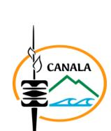

# 26-0218 - 3 INFIRMIERS EN SOINS GÉNÉRAUX

<a href="https://data.gouv.nc/explore/dataset/avis-de-vacances-de-poste-avp-drhfpnc/files/963ea0c8927d89e9c3e6b21e8ee9ec1c/download/" target="_blank" style="display: inline-block; padding: 8px 16px; background-color: #3f51b5; color: white; text-decoration: none; border-radius: 4px;">📄 Télécharger le PDF original</a>

<!--

-->

### 3 INFIRMIERS EN SOINS GÉNÉRAUX

**Référence : 3134-26-0218/SR du 2026-02-06**

## 🏢 Employeur

!!! success "📋 Candidature rapide"
    **Date limite :** 2026-07-16  
    **Direction :** DRHFPNC  
    **Domaine :** Infirmiers  
    **Statut :** ⏳ **Cette semaine** (≤7 jours)

**Corps /Domaine :** Infirmier en soins généraux **Direction : Direction des affaires sanitaires et sociales, de**

**la prévention et de la solidarité**

**Durée de résidence exigée pour le recrutement sur**

**titre :** au moins égale 5 ans

**Lieu de travail : CMS de CANALA**

**Poste à pourvoir :** dès que possible **Date de dépôt de l'offre :** Vendredi 2026-02-06

**Date limite de candidature :** Vendredi 2026-07-17

## La date de clôture initialement prévue le 2026-07-03 a été reportée.

# Détails de l'offre 
La Direction des Affaires sanitaires, Sociales, de la Prévention et de la Solidarité est organisée en 4 pôles (administration générale, Solidarité, Prévention et promotion de la santé, Soins), 8 services et 14 bureaux. La DASSPS comprend 249 agents. Les centres médico-sociaux sont gérés par le Chef du Bureau de Proximité de Soins (BPS) du Pôle Soins.

**Emploi RESPNC : Infirmier**

## 🎯 Missions

soins généraux assure sa fonction en conformité avec les textes régissant la profession et les protocoles organisationnels spécifiques définis institutionnellement et en équipe.

**Activités principales : La personne retenue aura notamment en charge :**

- Les actes curatifs (consultations, urgences, soins) ;

- Les actes préventifs (vaccinations, dépistages, PMI, santé scolaire, médecine du travail,

suivi des maladies chroniques...) ;

- Les actes éducatifs (hygiène de vie, éducation thérapeutique des patients chroniques,

santé scolaire…) ;

- La téléconsultation (en l'absence de médecin en présentiel).

**Activité secondaire :** - Assurer l'encadrement des stagiaires, notamment les étudiants infirmiers.

**Caractéristiques**

**particulières de l'emploi :** Ce poste est soumis à astreinte de nuit.

**Savoir / Connaissance/Diplôme exigé :**

**-** Diplôme d'état infirmier exigé ;

- Expérience du travail en poste isolé ;

- Expérience des urgences ;

- Être titulaire du permis de conduire B.

**Profil du candidat**

## 🛠️ Savoir-faire

- Maîtrise des logiciels de bureautique (Excel et Word) ;

**Comportement professionnel :**

**-** Disponibilité et rigueur ;

- Respect de la confidentialité des informations et du secret médical ;

- Sens des responsabilités ;

- Goût des relations humaines ;
- Esprit d'initiative ;
- Capacité d'écoute ;
- Goût du travail en équipe.

#### Contact et informations complémentaires 
Pour tout renseignement complémentaire, vous pouvez contacter :

**Direction des affaires sanitaires et sociales, de la prévention et de la solidarité**

Tél : [📞 47.71.00](tel:477100) ou [📞 47.72.30](tel:477230)

**Madame Patricia JOLLY Cheffe de bureau de proximité de soins « Sud Minier »**

Mail : [p.jolly@province-nord.nc](mailto:p.jolly@province-nord.nc) Tel : [📞 73.89.33](tel:738933)

Vous pouvez consulter l'ensemble des AVP sur le site de la DRHFPNC [\(www.drhfpnc.gouv.nc\)](http://www.drhfpnc.gouv.nc) ainsi que la réglementation et le répertoire des emplois (RESPNC). Le présent AVP est également consultable sur le site de la province-Nord ([www.province-nord.nc](http://www.province-nord.nc)).

# POUR RÉPONDRE À CETTE OFFRE

Les candidatures (CV détaillé, lettre de motivation, photocopie des diplômes, fiche de renseignements et demande de changement de corps ou cadre d'emplois si nécessaire\*) précisant la référence de l'offre doivent parvenir à **la Direction des Ressources Humaines (DRH) de la province Nord** par :

- Internet : <https://www.province-nord.nc/avp> - voie postale : BP 41 - 98860 Koné

- Dépôt physique : Hôtel de la province Nord - 41 avenue Jimmy Welepane – 98860 Koné

- Mail : [drh-emplois@province-nord.nc](mailto:drh-emplois@province-nord.nc)

(¹)Vous trouverez la liste des pièces à fournir afin de justifier de la citoyenneté ou de la durée de résidence dans le document intitulé « Notice explicative : pièces à fournir de votre citoyenneté ou de votre résidence » qui est à télécharger directement sur la page de garde des avis de vacances de poste sur le site de la DRHFPNC.

(²)La fiche de renseignements, l'attestation sur l'honneur de non bénéfice de la rupture conventionnelle et la demande de changement de corps ou cadre d'emploi sont à télécharger directement sur la page de garde des avis de vacances de poste sur le site de la DRHFPNC.

Toute candidature incomplète ne pourra être prise en considération ?

*Les candidatures de fonctionnaires doivent être transmises sous couvert de la voie hiérarchique*
---

## 🎯 Actions rapides

- 📄 [Télécharger le PDF original](#)
- ← [Retour à l'index](./)
- 💼 [Autres offres en Infirmiers](../#infirmiers)
- 🏢 [Toutes les offres DRHFPNC](./?direction=drhfpnc)

*[DRHFPNC]: Direction des Ressources Humaines de la Fonction Publique de Nouvelle-Calédonie
*[AVP]: Avis de Vacance de Poste
*[PMI]: Protection Maternelle et Infantile
