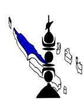

# 26-0489 - SAGE FEMME (Ouégoa-Pouébo)

<a href="https://data.gouv.nc/explore/dataset/avis-de-vacances-de-poste-avp-drhfpnc/files/bcbd64646c855ea412c47c2900b80b09/download/" target="_blank" style="display: inline-block; padding: 8px 16px; background-color: #3f51b5; color: white; text-decoration: none; border-radius: 4px;">📄 Télécharger le PDF original</a>

<!--

-->

## **SAGE FEMME (Ouégoa-Pouébo)**

!!! success "📋 Candidature rapide"
    **Date limite :** 2026-05-21  
    **Direction :** PVN  
    **Domaine :** Autres filières  
    **Statut :** 📋 En cours

**Référence : 3134-26-0489/SSR du 2026-04-03**

## 🏢 Employeur

**Corps /Domaine :** Sage-femme

**Durée de résidence exigée pour le recrutement sur**

**titre :** inférieure à 3 ans

**Poste à pourvoir :** au lendemain du 2026-07-18

**Direction : Direction des affaires sanitaires et sociales, de prévention et de la solidarité (DASSPS)/Service des Métiers de Soins/Bureau santé au féminin-secteur de Ouégoa, de Pouébo et de Koumac**

**Lieu de travail : CMS de Ouégoa et de Pouébo ; et CME**

**antenne de Koumac**

**Date limite de candidature :** Vendredi 2026-04-03

**Date limite de candidature :** Vendredi 2026-05-22

# Modification de la date de clôture initialement prévue le 24/04/2026.

## Détails de l'offre :

La DASSP compte 249 agents. Elle comprend une direction, des services centraux et décentralisés regroupés en quatre (4) pôles (Administration Générale, Solidarité, Prévention et Promotion de la Santé, Soins), 8 services et 14 bureaux*.*

Le Bureau santé au féminin du Service des Métiers de Soins faisant partie du Pôle Soins compte 7 agents (1 chef de bureau, 6 sages femmes).

**Emploi RESPNC : Sage-femme**

## 🎯 Missions

dans le cadre d'une polyvalence de secteur et au sein d'une équipe pluridisciplinaire, la personne retenue devra assurer les actes curatifs et préventifs de sage-femme, participer à l'application des programmes d'intervention et de

promotion de la santé et à la permanence de soins.

**Activités principales : La personne retenue aura notamment en charge :**

> **-** la mise en place des orientations politiques et administratives de la direction, en lien avec le réseau périnatalité ;

> - le suivi des grossesses avec orientation vers le médecin et/ou l'obstétricien si

pathologique ;

- le suivi gynécologique, la contraception, l'IVG, les dépistages (cancer du col, cancer du sein, IST) ;

- les activités de PMI (l'éducation et la promotion de la santé en matière d'allaitement, de vaccination, de développement psychomoteur, d'hygiène de vie et alimentaire du nourrisson de 0 à 2 ans etc…) ;

- la liaison avec le réseau social (enfance en danger, violence intra ou extra conjugale etc..) et partenarial (réseau périnatalité).

**Activités secondaires : La personne retenue aura également en charge :**

> - les actions de prévention (santé sexuelle en milieu scolaire et/ou santé communautaire ;

> - l'évaluation et la restitution de l'activité (cotation et codification, bilan d'activité des actions de prévention) ;

- les enquêtes épidémiologiques ;

- les urgences gynécologiques ou obstétricales de sage-femme (accouchements).

#### **Caractéristiques particulières de l'emploi :**

Ce poste peut être soumis à astreinte.

#### **Profil du candidat Savoir / Connaissance/Diplôme exigé :**

- **-** être titulaire du diplôme d'Etat de sage-femme ;
- compétences en échographie exigées ;
- être titulaire du permis de conduire B.

#### **Savoir-faire :**

- maîtrise des logiciels de bureautique (Excel et Word) ;
- une expérience professionnelle serait appréciée.

### **Comportement professionnel :**

- disponibilité et rigueur ;
- respect de la confidentialité des informations et du secret médical ;
- sens des responsabilités
- goût des relations humaines ;
- esprit d'initiative ;
- capacité d'écoute ;
- goût du travail en équipe.

### **Contact et informations complémentaires :**

Pour tout renseignement complémentaire, vous pouvez contacter **Madame Cécile BLANC-LECERF, Cheffe de Bureau Santé au Féminin - Direction des affaires sanitaires et sociales, de la prévention et de la solidarité** - Tél : [📞 47.71.00](tel:477100) ou

[📞 42.10.85](tel:421085)/ mail : [c.lecerf@province-nord.nc](mailto:c.lecerf@province-nord.nc)

Vous pouvez consulter l'ensemble des AVP sur le site de la DRHFPNC [\(www.drhfpnc.gouv.nc\)](http://www.drhfpnc.gouv.nc) ainsi que la réglementation et le répertoire des emplois (RESPNC). Le présent AVP est également consultable sur le site de la province-Nord [\(www.province-nord.nc\)](http://www.province-nord.nc).

## **POUR RÉPONDRE À CETTE OFFRE**

Les candidatures (CV détaillé, lettre de motivation, photocopie des diplômes, fiche de renseignements et demande de changement de corps ou cadre d'emplois si nécessaire (2)) précisant la référence de l'offre doivent parvenir à **la Direction des Ressources Humaines (DRH) de la province Nord** par :

- voie postale : BP 41 - 98860 Koné

- dépôt physique : Hôtel de la province Nord - 41 avenue Jimmy Welepane – 98860 Koné

- mail : [drh.emplois@province-nord.nc](mailto:drh.emplois@province-nord.nc)

(1)Vous trouverez la liste des pièces à fournir afin de justifier de la citoyenneté ou de la durée de résidence dans le document intitulé "Notice explicative : pièces à fournir pour justifier de votre citoyenneté ou de votre résidence" qui est à télécharger directement sur la page de garde des avis de vacances de poste sur le site de la DRHFPNC.

(2)La fiche de renseignements et la demande de changement de corps ou cadre d'emploi sont à télécharger directement sur la page de garde des avis de vacances de poste sur le site de la DRHFPNC. Toute candidature incomplète ne pourra être prise en considération.

*Les candidatures de fonctionnaires doivent être transmises sous couvert de la voie hiérarchique*
---

## 🎯 Actions rapides

- 📄 [Télécharger le PDF original](#) {target="_blank"}
- ← [Retour à l'index](./)
- 💼 [Autres offres en Autres filières](../#autres-filieres)
- 🏢 [Toutes les offres DRHFPNC](./?direction=pvn)

*[DRHFPNC]: Direction des Ressources Humaines de la Fonction Publique de Nouvelle-Calédonie
*[AVP]: Avis de Vacance de Poste
*[PMI]: Protection Maternelle et Infantile
*[IVG]: Interruption Volontaire de Grossesse
*[IST]: Infections Sexuellement Transmissibles
