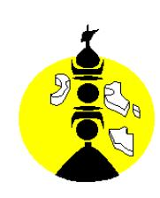

---
hide:
  - navigation
---

# 26-0566 - Chef de projet

<a href="https://data.gouv.nc/explore/dataset/avis-de-vacances-de-poste-avp-drhfpnc/files/507b557f23395cbc08fe95a1a86c0b65/download/" target="_blank" style="display: inline-block; padding: 8px 16px; background-color: #3f51b5; color: white; text-decoration: none; border-radius: 4px;">📄 Télécharger le PDF original</a>

## **1 Chef de projet**

**Référence :** 3134-26-0566/SR du 17/04/2026

**Employeur : Agence sanitaire et sociale de la Nouvelle-Calédonie**

**Corps /Domaine :** Attaché **Direction :** Programme pathologies de surcharge

**Durée de résidence exigée**

**Pour le recrutement sur titre (1) :** au moins égale à 10

ans

**Poste à pourvoir :** juillet 2026

**Lieu de travail :** Nouméa

**Date de dépôt de l'offre : 17 avril 2026**

**Date limite de candidature : 08 mai 2026**

## Détails de l'offre :

La délibération n°114 du 24 mars 2016 relative au plan de santé calédonien « Do Kamo, Être épanoui ! » concernant l'organisation, la gouvernance, le pilotage et la régulation du système de protection sociale et de santé a posé les bases d'un renouveau en matière de santé publique et de protection sociale. L'axe 3 de ce plan place la promotion de la santé au cœur du dispositif.

L'agence sanitaire et sociale de la Nouvelle-Calédonie, établissement public administratif, a pour objet de faciliter la garantie du droit à la santé pour tous. Elle met en œuvre les programmes prioritaires de prévention et de promotion de la santé décidés par la Nouvelle-Calédonie. Le programme de prévention des pathologies de surcharge pondérale a pour objectif de promouvoir les comportements favorables à la santé et en particulier une alimentation saine et la pratique d'une activité physique adaptée dans l'objectif de prévenir des pathologies liées au surpoids et à l'obésité. C'est dans ce cadre que l'ASSNC est à la recherche d'un chef de projet.

**Emploi RESPNC : Chef de projet**

**Missions** : Le chef de projet a pour mission, et en transversalité avec l'ensemble des programmes de l'agence :

- Coordonner et/ou participer aux actions et projets du programme et aux projets transversaux avec les différents programmes de l'agence,
- Mener des sensibilisations auprès de tout type de public : grand public, en milieu scolaire, en milieu professionnel et auprès de publics spécifiques sur les comportements favorables à la santé (alimentation/activité physique/approche globale)
- Contribuer à l'analyse du besoin en matière d'alimentation saine et de promotion de l'activité physique, à l'identification des acteurs, à l'étude des systèmes et organisations, dans le cadre de projets en promotion de la santé,
- Entretenir le réseau de partenaires, en lien avec les projets du programme,
- Contribuer à l'évaluation des projets,
- Participer au suivi de l'atteinte des objectifs des projets, depuis la phase d'étude jusqu'à sa réalisation en s'assurant du respect des contraintes, et des délais,
- Proposer des solutions, des mesures de simplifications ou des innovations,

- Contribuer à la communication du programme (projets, campagnes de communication, réseaux),
- Contribuer au reporting des actions et projets du programme

- **Missions secondaires :** Contribuer à des projets transversaux de l'ASSNC, pour lesquels le programme est sollicité,
  - Contribuer à des projets en lien avec les organismes régionaux et internationaux de santé publique,
  - Contribuer à la veille bibliographique du programme

# **Profil du candidat : Savoir/Connaissance/Diplôme exigé :**

- Expérience en gestion de projet, si possible en promotion de la santé
- Culture en santé publique et expérience dans le domaine d'action
- Appétence pour le sport santé et les recommandations en matière d'alimentation saine, équilibrée et des bonnes pratiques pour un mode de vie favorable à sa santé
- Connaissance de l'environnement sanitaire et social et du fonctionnement des institutions de la Nouvelle Calédonie
- Connaissances des spécificités culturelles néo-calédoniennes
- Connaissance des orientations de la politique de santé « Do Kamo, être épanoui »
- Master en santé publique ou en gestion de projets apprécié

### **Savoir-faire :**

- Analyser un contexte, une problématique, une complexité
- Travailler en réseau de partenaires
- Bonnes capacités de gestion de projet, suivi d'activités et d'indicateurs
- Evaluer une procédure, une activité, une action, un résultat
- Capacités de synthèse et rédaction
- Maîtrise du Pack office

### **Comportement professionnel :**

- Sens du relationnel et aptitude au travail en équipe
- Autonomie, adaptation et rigueur
- Goût pour l'interculturalité
- Grande capacité d'organisation

# **Caractéristiques particulières de l'emploi :**

- Permis B
- Des déplacements sur l'ensemble de la Nouvelle-Calédonie sont possibles
- Des interventions en week-end sont possibles

# **Contact et informations complémentaires :**

Pour tout renseignement complémentaire, vous pouvez contacter madame Caroline Fulchiron, responsable de programme pathologies de surcharge.

Tel : 25.07.72 Mail : caroline.fulchiron@ass.nc

Les candidatures (CV détaillé, lettre de motivation, photocopie des diplômes, fiche de renseignements, attestation sur l'honneur de non-bénéfice de la rupture conventionnelle, 3 dernières évaluations professionnelles ainsi que la demande de changement de corps ou cadre d'emplois si nécessaire (2)) précisant la référence de l'offre doivent parvenir à la direction de l'ASSNC soit par :

- voie postale : BP P4 98851 NOUMEA CEDEX

- dépôt physique : Centre-ville – 16, rue du Général Gallieni – 3ème étage

- email : [recrutement@ass.nc](mailto:recrutement@ass.nc)

(1) Vous trouverez la liste des pièces à fournir afin de justifier de la citoyenneté ou de la durée de résidence dans le document intitulé "Notice explicative : pièces à fournir pour justifier de votre citoyenneté ou de votre résidence" qui est à télécharger directement sur la page de garde des avis de vacances de poste sur le site de la DRHFPNC.

(2) La fiche de renseignements et la demande de changement de corps ou cadre d'emploi sont à télécharger directement sur la page de garde des avis de vacances de poste sur le site de la DRHFPNC.

Toute candidature incomplète ne pourra être prise en considération.

**Les candidatures de fonctionnaires doivent être transmises sous couvert de la voie hiérarchique.**