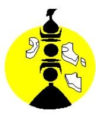
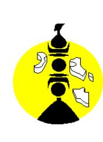

# 26-0567 - Sage-femme

<a href="https://data.gouv.nc/explore/dataset/avis-de-vacances-de-poste-avp-drhfpnc/files/b5847c1003211410489f1a09bb3b3b72/download/" target="_blank" style="display: inline-block; padding: 8px 16px; background-color: #3f51b5; color: white; text-decoration: none; border-radius: 4px;">📄 Télécharger le PDF original</a>

<!--

-->

# **1 Sage-femme**

!!! success "📋 Candidature rapide"
    **Date limite :** 2026-05-07  
    **Direction :** PIL  
    **Domaine :** Autres filières  
    **Statut :** ⏳ **Cette semaine** (≤7 jours)

**Référence : 3134-26-0567/SR du 2026-04-17**

## 🏢 Employeur

**Corps /Domaine :** Sage-femme / cadre de la santé

**Durée de résidence exigée :** au moins égale à 10 ans

**Poste à pourvoir :** Immédiatement

**Direction :** générale des services de Maré

Service de la coordination du pôle « l'humain au centre de

l'action provinciale »

**Lieu de travail :** CMS de NENGONE

**Date de dépôt de l'offre :** Vendredi 2026-04-17

**Date limite de candidature :** Vendredi 2026-05-08

# Détails de l'offre :

**Emploi RESPNC : Sage-Femme**

L'agent est sous l'autorité de l'adjoint au chef de service de l'action sanitaire, responsable du centre médical.

**Missions principales :** - Suivi des grossesses

- Suivi de la PMI

- Suivi gynécologique classique (frottis, contraceptions)

- Assumer les responsabilités de sage-femme de santé publique,

- Appliquer les programmes sanitaires provinciaux y compris prévention,

- Assurer les consultations de gynécologie et d'obstétrique,

- Assurer le suivi des grossesses,

- Assister des médecins dans les consultations de protection materno-infantile,

- Assurer des consultations de planning familial,

- Assurer la prise en charge des patientes dans le cadre de l'urgence gynéco-obstétricale en collaboration avec le médecin,

- Assurer le suivi des femmes hospitalisées dans la spécialité au centre médical,

- Saisir dans le logiciel médical « asclepios » les codes de pathologies diagnostiquées et des actes pratiqués dans l'exercice quotidien.

- Réaliser la rééducation du périnée en poste partum ou en urologie-gynécologie,

- Travailler en lien avec le réseau périnatal et les partenaires sociaux de la PIL et en psychologie (AMP) sur les situations de vulnérabilité durant la grossesse,

- Réaliser les entretiens prénataux précoces,

- Proposer selon les désirs et les disponibilités, des cours de préparation à l'accouchement,

- Réaliser l'IVG médicamenteuse.

### **Profil du candidat Savoir / Connaissance/Diplôme exigé :**

- Expérience en échographie obstétricale (diplôme universitaire d'échographie obstétricale souhaité),
- Gynécologie-Obstétrique,
- Hygiène hospitalière,

## 📋 Activités

- Maîtrise de l'outil informatique (logiciel médical asclepios, les codes pathologiques diagnostiquées),
- **-** Permis B exigé.

## **Savoir-faire :**

- **-** Analyser, synthétiser des informations permettant la prise en charge de la personne soignée et la continuité des soins,
- **-** Analyser et évaluer la situation clinique d'une personne.
- **-** Capacités rédactionnelles et de communication

## **Comportement professionnel :**

- Sens du service public,
- Sens de l'organisation et des responsabilités,
- Adaptabilité,
- Respect,
- Disponibilité et rigueur,
- Discrétion,
- Esprit d'équipe,
- Sens de l'écoute

#### **Contact et informations complémentaires :**

Pour tout renseignement complémentaire, vous pouvez contacter Monsieur Sergio UEDRE [s-uedre@loyalty.nc](mailto:s-uedre@loyalty.nc) adjoint au chef de service par intérim de l'action sanitaire à la direction générale des services de Maré de la province des îles loyauté, Tél : [📞 45.41.01](tel:454101) et monsieur Alain SIWOINE, directeur de la direction générale des services de Maré de la province des îles Loyauté, Tél : [📞 45.49.15](tel:454915) / ou par mail : a[-siwoine@loyalty.nc](mailto:a-siwoine@loyalty.nc)

ou Madame Marie-Rose WAÏA, directrice à la direction de l'action communautaire et de l'action sanitaire de la province des îles Loyauté, Tél : [📞 45.52.46](tel:455246) /mail : : [rh-dacas@loyalty.nc](mailto:rh-dacas@loyalty.nc)

Vous pouvez consulter l'ensemble des AVP sur le site de la province des iles loyauté ([www.province-iles.nc/avp\)](http://www.province-iles.nc/avp) ou sur le site de la DRHFPNC ([www.drhfpnc.gouv.nc](http://www.drhfpnc.gouv.nc)) ainsi que la réglementation et le répertoire des emplois (RESPNC).

# **POUR RÉPONDRE À CETTE OFFRE**

Les candidatures (CV détaillé, lettre de motivation, photocopie des diplômes, fiche de renseignements et demande de changement de corps ou cadre d'emplois si nécessaire) précisant la référence de l'offre doivent parvenir à la direction des ressources humaines de la province des îles Loyauté, service des recrutements et du développement des compétences, par :

- voie postale : BP 50 – 98820 WE LIFOU

- dépôt physique : Hôtel de la province des îles Loyauté à Wé – Lifou

- mail : [drh-recrutement@loyalty.nc](mailto:drh-recrutement@loyalty.nc)

- le site de la province des iles loyauté : [www.province-iles.nc/avp](http://www.province-iles.nc/avp)

*Les candidatures de fonctionnaires doivent être transmises sous couvert de la voie hiérarchique Toute candidature incomplète ne sera pas prise en considération.*

#### Publication et diffusion :

- *Établissement provincial de l'emploi, de la formation et de l'insertion professionnelle (EPEFIP)*
- *- Tous services provinciaux des Iles Loyauté pour affichage*
---

## 🎯 Actions rapides

- 📄 [Télécharger le PDF original](#) {target="_blank"}
- ← [Retour à l'index](./)
- 💼 [Autres offres en Autres filières](../#autres-filieres)
- 🏢 [Toutes les offres DRHFPNC](./?direction=pil)

*[DRHFPNC]: Direction des Ressources Humaines de la Fonction Publique de Nouvelle-Calédonie
*[AVP]: Avis de Vacance de Poste
*[PMI]: Protection Maternelle et Infantile
*[IVG]: Interruption Volontaire de Grossesse
*[PIL]: Province des Îles Loyauté
