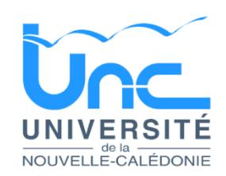

# 26-0579 - Ingénieur en ingénierie logicielle

<a href="https://data.gouv.nc/explore/dataset/avis-de-vacances-de-poste-avp-drhfpnc/files/c31c3106c0777564786a001ae5b7b232/download/" target="_blank" style="display: inline-block; padding: 8px 16px; background-color: #3f51b5; color: white; text-decoration: none; border-radius: 4px;">📄 Télécharger le PDF original</a>

<!--

-->

# **Un ingénieur ou une ingénieure en ingénierie logicielle – Développeur & Support Applications Cocktail**

!!! success "📋 Candidature rapide"
    **Date limite :** 2026-05-07  
    **Direction :** UNC  
    **Domaine :** Informatique  
    **Statut :** ⏳ **Cette semaine** (≤7 jours)

**Référence : 3134-26-0579/SR du 2026-04-17**

## 🏢 Employeur

**Corps/Domaine :** Un ingénieur informatique du 1 er ou du 2 ème grade de la fonction publique de la Nouvelle-Calédonie ou un ingénieur d'étude du cadre état (ministère de l'enseignement)

**Durée de résidence exigée (1) : /**

**pour le recrutement sur titre**

**Poste à pourvoir :** dès que possible

**Direction : Direction du Numérique et des Systèmes d'Information (DNSI)**

**Lieu de travail :** Nouméa – Campus de Nouville

**Date de dépôt de l'offre :** 2026-04-17

**Date limite de candidature :** 2026-05-08

# Détails de l'offre :

L'Université de la Nouvelle-Calédonie est un établissement pluridisciplinaire qui répond notamment aux besoins de formation et de recherche propres à la Nouvelle-Calédonie. Elle veille à accompagner efficacement les évolutions de la Nouvelle-Calédonie et à répondre à ses besoins spécifiques. L'UNC, ancrée dans son environnement et sa région, a pour ambition de promouvoir son activité de recherche sur la base de l'excellence et de la reconnaissance nationale et internationale. Cette promotion passe par la mise en valeur de ses enjeux scientifiques, de ses capacités d'innovation et de transfert ainsi que par la qualité des formations qu'elle dispense.

L'UNC mène une politique académique et scientifique dynamique et reconnue. Ainsi l'UNC est notamment lauréate des appels à projets "Nouveaux cursus à l'université" et "Dispositifs territoriaux pour l'orientation vers les études supérieures" du Programme d'Investissement d'Avenir 3 et plus récemment des appels à projets « Accélération des Stratégies de Développement des Établissements d'Enseignement Supérieur et de Recherche » et « ExcellencES » du Programme d'Investissement d'Avenir 4. Sur le plan scientifique, l'université est lauréate d'un appel à projets très sélectif du schéma directeur pour la recherche et l'innovation "Horizon 2020" (RISE-MSCA) de la commission européenne.

L'UNC en chiffres, c'est 250 personnels, 3 800 étudiants, 3 départements de formation (Droit, Économie, Gestion ; Lettres, Langues, Sciences Humaines ; Sciences et Techniques), 1 IAE, 1 IUT, 1 INSPE, 1 pôle Formation continue et alternance (Pôle FCA), 3 équipes de recherche, 2 UMR, 1 école doctorale.

L'UNC, c'est également deux campus dynamiques (Nouville en province Sud et Baco en province Nord), des infrastructures modernes (installations dédiées à la recherche et aux pédagogies innovantes, plateaux techniques, studio audiovisuel, Fablab, etc.) des installations sportives de qualité, un accès privilégié à la vie culturelle et artistique, et un environnement et une qualité de travail uniques.

Pour renforcer une équipe de 3 personnes, la Direction du Numérique et des Systèmes d'Information (DNSI) qui en compte 14 recrute pour son pôle « applications et plateformes Web » un **ingénieur en ingénierie logicielle (Référens BAP E – E2C45)** spécialisé dans le développement et le support des applications **Cocktail**.

Emploi Référens BAP E : **: Ingénieur en ingénierie logicielle (fiche E2C45), Développeur et support applications Cocktail**

## **Missions : Développement et intégration**

- Développer des évolutions spécifiques autour de la suite Cocktail.
- Réaliser des interfaces entre Cocktail et d'autres applications du SI (scolarité, finances, RH, LMS, outils décisionnels).
- Concevoir et maintenir des API, web services et scripts d'automatisation.
- Participer aux montées de version et aux phases de recette technique.

- Traduire les besoins métiers en solutions techniques adaptées en lien avec les services fonctionnels.
- Garantir la cohérence technique des solutions mises en œuvre.

## **Support applicatif et expertise technique (N2/N3)**

- Assurer un support applicatif de niveau expert sur des applications critiques pour l'établissement.
- Contribuer à la fiabilisation des environnements et à la résolution des incidents complexes.
- Analyser et résoudre des incidents complexes.
- Diagnostiquer les anomalies fonctionnelles ou techniques.
- Assurer un appui technique aux gestionnaires métiers.
- Documenter les procédures et maintenir la base de connaissances.

# **Administration et exploitation applicative**

- Participer à l'exploitation des applications en production (suivi, diagnostic, amélioration continue)
- Garantir la qualité et l'intégrité des données.
- Participer à la sécurisation des accès et au respect du RGPD.
- Prendre en compte les enjeux de cohérence, de performance et de sécurité des échanges entre applications.
- Intervenir dans un système d'information complexe et fortement interconnecté.

#### **Pilotage technique et amélioration continue**

- Contribuer aux choix d'architecture applicative.
- Participer aux projets de modernisation (urbanisation, APIisation, dématérialisation).
- Être force de proposition sur l'optimisation des processus numériques.
- Participer à la diffusion des bonnes pratiques au sein de l'équipe.

#### **L'environnement technique du pôle repose notamment sur**

- Développement Java / Spring Boot et framework Vaadin pour les applications Web ;
- Usine logicielle basée sur GitLab (gestion de sources, CI/CD, automatisation des builds et déploiements) ;
- Déploiements applicatifs en environnement conteneurisé (Kubernetes)
- Bases de données Oracle et PostgreSQL ;
- l'utilisation de l'apport que peut apporter l'IA dans le périmètre au quotidien est favorisé.
- Outils collaboratifs et de suivi : Jira, Confluence, méthodes agiles adaptées au contexte universitaire.

Le poste s'inscrit dans une démarche d'amélioration continue des pratiques de développement, de qualité logicielle et d'industrialisation.

#### **Environnement technique**

# **Compétences technique attendues :**

- Maîtrise d'un ou plusieurs langages : Java, PHP, PL/SQL ou équivalent.
- Excellente maîtrise SQL (PostgreSQL, Oracle ou équivalent).
- Connaissance des architectures web (Tomcat, Apache, REST).
- Expérience en intégration d'applications et interopérabilité SI.
- Gestion de versions (Git).

## **Environnement métier (Connaissance de Cocktail + expérience enseignement supérieur)**

- Connaissance de la suite Cocktail.
- Connaissance des processus universitaires (scolarité, inscriptions, maquettes, diplômes).
- Expérience dans un environnement d'enseignement supérieur ou public.

#### **Compétences comportementales :**

- Aptitudes au travail en équipe et en mode projet ;
- Curiosité technologique
- Intérêt marqué pour l'utilisation des outils d'intelligence artificielle dans les pratiques quotidiennes de développement.
- Sens de la communication et de l'écoute
- Esprit d'équipe, solidarité
- Rigueur, sens de l'organisation et réactivité
- Esprit d'initiative et autonomie.

## **Enjeux du poste**

- Sécurisation et fiabilisation du SI COKTAIL.
- Réduction de la dette technique.
- Amélioration de l'expérience utilisateur.
- Maintien de la cohérence technique et de l'interopérabilité des applications du périmètre.
- Fiabilisation de l'exploitation et amélioration continue de la qualité de service.

#### **Profil du candidat :**

- Bac+5 en informatique / systèmes d'information.
- Expérience confirmée en développement applicatif (3 à 5 ans minimum).
- Capacité d'analyse et de diagnostic avancé.
- Autonomie, rigueur et sens du service public.
- Capacité à dialoguer avec des interlocuteurs non techniques.

# **Caractéristiques particulières de l'emploi :**

- Selon certaines conditions, l'UNC offre la possibilité de télétravailler jusqu'à 1,5 jours par semaine.

**Contact et** Direction du Numérique et des Systèmes d'Information (DNSI)

**informations complémentaires :** Monsieur Emmanuel BONNET [emmanuel.bonnet@unc.nc](mailto:emmanuel.bonnet@unc.nc) Tél (687) 290 094 Direction des Ressources Humaines, [recrutement@unc.nc](mailto:recrutement@unc.nc) Tél (687) 290 020

# POUR RÉPONDRE À CETTE OFFRE

Les dossiers de candidature **en format PDF** (CV détaillé, lettre de motivation, photocopie diplôme le plus élevé, fiche de renseignements\*) précisant la référence de l'offre doivent parvenir à la Direction des Ressources Humaines de l'Université de la Nouvelle-Calédonie par :

- Voie postale (BP R4 98851 Nouméa cedex)
- Dépôt physique (Campus de Nouville)
- Mail : [recrutement@unc.nc](mailto:recrutement@unc.nc) copie à [emmanuel.bonnet@unc.nc](mailto:emmanuel.bonnet@unc.nc)

\*La fiche de renseignements est à télécharger directement sur la page de garde des avis de vacances de poste sur le site de la DRHFPNC. Toute candidature incomplète ne pourra être prise en considération.

*Les candidatures de fonctionnaires doivent être transmises sous couvert de la voie hiérarchique*
---

## 🎯 Actions rapides

- 📄 [Télécharger le PDF original](#) {target="_blank"}
- ← [Retour à l'index](./)
- 💼 [Autres offres en Informatique](../#informatique)
- 🏢 [Toutes les offres DRHFPNC](./?direction=unc)

*[DRHFPNC]: Direction des Ressources Humaines de la Fonction Publique de Nouvelle-Calédonie
*[RH]: Ressources Humaines
