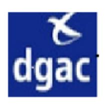

# 26-0696 - 3 Contrôleurs aériens d'approche (ICNA)

<a href="https://data.gouv.nc/explore/dataset/avis-de-vacances-de-poste-avp-drhfpnc/files/f8f1f2343f319203ae7518759711ca01/download/" target="_blank" style="display: inline-block; padding: 8px 16px; background-color: #3f51b5; color: white; text-decoration: none; border-radius: 4px;">📄 Télécharger le PDF original</a>

<!--

-->

# 3 Contrôleurs aériens d'approche (ICNA)

!!! success "📋 Candidature rapide"
    **Date limite :** 2026-05-28  
    **Direction :** DAC  
    **Domaine :** Autres filières  
    **Statut :** 📋 En cours

**Référence : 3134-26-0696/SR du 2026-05-08**

## 🏢 Employeur

**Corps ou Cadre d'emploi /Domaine : Direction de l'aviation civile en Nouvelle-Calédonie (DAC)**

Ingénieur des études et de l'exploitation

**Durée de résidence exigée Lieu de travail :** TONTOUTA

**pour le recrutement sur titre (1) :** /

**Poste à pourvoir :** immédiatement **Date de dépôt de l'offre :** vendredi 2026-05-08

**Date limite de candidature :** vendredi 2026-05-29

# Détails de l'offre 
**Emploi RESPNC :** Contrôleur aérien d'approche

## 🎯 Missions

contrôle de l'organisme de la navigation aérienne de Nouméa-La-Tontouta.

**Activités principales :** - Assurer le service de la circulation aérienne pour l'organisme de Nouméa - La Tontouta

(contrôle en route, d'approche et d'aérodrome) sur un poste de travail pour :

- Prévenir les abordages ;

- Prévenir les collisions sur les aires de manœuvre ;

- Accélérer et ordonner la CA en organisant le trafic, en préparant les séquences d'approche et en les réalisant, en participant aux mesures de régulation, et ce en intégrant les contraintes

d'environnement.

- Assurer le service d'alerte et son déclenchement si nécessaire ;

- Assurer la continuité des services en liaison avec les organismes adjacents.

**Activités secondaires :** - Participer à l'instruction des stagiaires en cours de qualification (formation pratique notamment) ;

- Participer à la qualité de service de sécurité du service navigation aérienne ;

- Participer, le cas échéant, aux évaluations en vue de la délivrance ou au renouvellement des

mentions d'unité ;

- Participer, le cas échéant, à l'évaluation des futurs instructeurs sur position en vue de la

délivrance de la mention d'instructeur ;

- Participer au SMI du SNA.

## Caractéristiques particulières de l'emploi 
### Qualifications 
- Détenteur d'une mention d'unité Approche ou CCR valide ;

- Détenteur d'une mention linguistique valide ;

- L'affectation sur ces postes nécessite l'exercice des qualifications licences ADI/ADV - APP/APS -

ACP/ACS ;

- Les agents devront suivre, impérativement avant la date de leur affectation, le stage transfo leur permettant de rafraîchir leurs connaissances sur ces qualifications licence, s'ils ne les ont

pas exercées depuis 4 ans.

**Profil du candidat** Savoir / Connaissances / Diplôme exigé :

- Réglementation de la navigation aérienne ;
- Organisation des différents services de la circulation aérienne et les procédures d'exploitation ;
- Consignes et Manuel d'exploitation ;
- Niveau 4 en langue anglaise.

## Savoir-faire 
- Analyser, anticiper et décider ;
- Gérer les situations d'urgence ;
- S'adapter aux évolutions techniques et opérationnelles ;
- Communiquer en anglais.

### Comportement professionnel 
- Sens du travail en équipe ;
- Maîtrise de soi ;
- Sens des responsabilités ;
- Esprit d'analyse.

**Contact et informations** Thierry DURIGNEUX - Tél : [📞 26 52 70](tel:265270) / mail :[✉️ thierry.durigneux@aviation-civile.gouv.fr](mailto:thierry.durigneux@aviation-civile.gouv.fr) **complémentaires :** ou Tangi GARNIER - Tél: [📞 26 52 70](tel:265270) / mail : *[✉️ tangi.garnier@aviation-civile.gouv.fr](mailto:tangi.garnier@aviation-civile.gouv.fr)*

# POUR RÉPONDRE À CETTE OFFRE

Les candidatures (CV détaillé, lettre de motivation, photocopie des diplômes et fiche de renseignements, ainsi que la demande de changement de corps ou cadre d'emplois si nécessaire (2)) précisant la référence de l'offre doivent parvenir à **la direction de l'aviation civile** par :

- Voie postale : **B.P. H1 98849 Nouméa cedex**

- Dépôt physique : **179 rue Roger GERVOLINO - Magenta**

- Mail : **[dac-nc-sa-bpers@aviation-civile.gouv.fr](mailto:dac-nc-sa-bpers@aviation-civile.gouv.fr)**

(1)Vous trouverez la liste des pièces à fournir afin de justifier de la citoyenneté ou de la durée de résidence dans le document intitulé "Notice explicative : pièces à fournir pour justifier de votre citoyenneté ou de votre résidence" qui est à télécharger directement sur la page de garde des avis de vacances de poste sur le site de la DRHFPNC.

(2)La fiche de renseignements et la demande de changement de corps ou cadre d'emploi sont à télécharger directement sur la page de garde des avis de vacances de poste sur le site de la DRHFPNC Toute candidature incomplète ne pourra être prise en considération.

**Les candidatures de fonctionnaires doivent être transmises sous couvert de la voie hiérarchique**
---

## 🎯 Actions rapides

- 📄 [Télécharger le PDF original](#)
- ← [Retour à l'index](./)
- 💼 [Autres offres en Autres filières](../#autres-filieres)
- 🏢 [Toutes les offres DRHFPNC](./?direction=dac)

*[DRHFPNC]: Direction des Ressources Humaines de la Fonction Publique de Nouvelle-Calédonie
