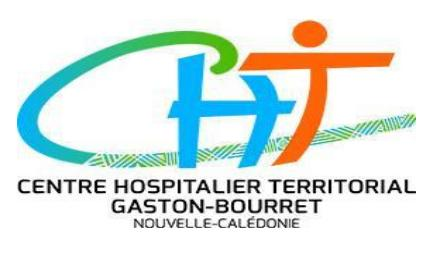

# 26-0772 - Secrétaire-comptable

<a href="https://data.gouv.nc/explore/dataset/avis-de-vacances-de-poste-avp-drhfpnc/files/3a1baf73396b21996857e60bac81ba2f/download/" target="_blank" style="display: inline-block; padding: 8px 16px; background-color: #3f51b5; color: white; text-decoration: none; border-radius: 4px;">📄 Télécharger le PDF original</a>

<!--

-->

### Secrétaire-comptable

**Référence : 3134-26-0772/SR du 2026-05-22**

## 🏢 Employeur

!!! success "📋 Candidature rapide"
    **Date limite :** 2026-06-11  
    **Direction :** Ville du Mont-Dore  
    **Domaine :** Autres filières  
    **Statut :** 📋 En cours

**Corps ou Cadre d'emploi / Domaine :** rédacteur **Direction :** des services techniques et de proximité

**Durée de résidence exigée pour le recrutement sur titre (1) :** /

**Date de dépôt de l'offre :** vendredi 2026-05-22

**Poste à pourvoir :** immédiatement **Date limite de candidature :** vendredi 2026-06-12

## Détails de l'offre 
Placé(e) sous l'autorité de la cheffe de service, l'agent retenu exercera les fonctions de secrétariat et de comptabilité publique au sein du service administratif de la direction des services techniques et de proximité.

**Emploi RESPNC :** secrétaire-comptable

## 🎯 Missions

- Suivi financier et administratif des commandes et des marchés publics

- Gestion administrative et logistique des moyens de la direction, en ressources

humaines et équipement

#### Secrétariat 
- Frappe des courriers

- Suivi administratif des assurances des véhicules municipaux

**Activités principales :** - Suivi des dossiers de déclarations de sinistres

- Consultation des entreprises, des agents, contrôle puis commande des vêtements de travail et équipements de protection individuelle

- Actualisation des données en ressources humaines (suivi des absences du personnel).

- Gestion de l'agenda de la direction

#### Comptabilité 
- Etablissement des bons de commande et engagements sur le logiciel de comptabilité

- Gestion comptable des factures, liquidation et archivage

- Gestion administrative et comptable des marchés publics

- Actualisation des données comptables du tableau de bord du service

**Spécificités de l'emploi :**

- Respect des dispositions prévues par la charte d'accueil de la Ville.

#### Profil du candidat : Savoir / Connaissance 
- Expérience confirmée en secrétariat
- Connaissance des règles et procédures de la commande publique
- Connaissances exigées en comptabilité publique M14
- Connaissances exigées en réglementation des marchés publics
- Connaissance du fonctionnement et de l'organisation des collectivités publiques serait appréciée ;

**Lieu de travail :** La Coulée – Mont Dore

#### Savoir-faire 
- Maîtrise de l'outil informatique (publipostage, traitement de texte, tableur, messagerie électronique)
- Connaissance du logiciel MILLESIME (comptabilité) souhaitée.
- Connaissance des logiciels DOCUWARE (gestion de courrier et factures) et Mainti (demandes d'interventions) souhaitée
- Bonnes qualités rédactionnelles

#### Comportement professionnel 
- Sens du service public
- Rigueur, sérieux et discrétion professionnelle
- Autonomie et disponibilité
- Sens de l'organisation (capacité à gérer les priorités), polyvalence
- Esprit d'initiative
- Bonne présentation
- Bon relationnel, aisance orale, sens de l'écoute
- Respect de la hiérarchie
- Respect des horaires

**Contact et informations complémentaires :**

Madame Laure BOUVIER – Cheffe du service administratif

Courriel : [laure.bouvier@ville-montdore.nc](mailto:laure.bouvier@ville-montdore.nc)

Tél : [📞 43.30.36](tel:433036)

# POUR RÉPONDRE À CETTE OFFRE

Les candidatures précisant la référence du présent AVP doivent être accompagnées **impérativement** des documents suivants :

### Tout dossier incomplet ne sera pas recevable 
- Curriculum vitae détaillé,
- Lettre de motivation,
- Photocopie des diplômes,
- Fiche de renseignements
- Demande de changement de corps ou cadre d'emplois si nécessaire⁽²⁾
- Attestation sur l'honneur de non-bénéfice de la rupture conventionnelle.

Les dossiers complets doivent parvenir à Madame le Maire du Mont-Dore par :

- Voie postale : Ville du Mont-Dore BP 3 98810 Mont-Dore
- Voie électronique : [mairie@ville-montdore.nc](mailto:mairie@ville-montdore.nc)
- Dépôt physique : Mairie du Mont-Dore 4468 avenue des deux baies Boulari
- Fax : [📞 43.64.94](tel:436494)

(1)Vous trouverez la liste des pièces à fournir afin de justifier de la citoyenneté ou de la durée de résidence dans le document intitulé "Notice explicative : pièces à fournir pour justifier de votre citoyenneté ou de votre résidence" qui est à télécharger directement sur la page de garde des avis de vacances de poste sur le site de la DRHFPNC.

(2)La fiche de renseignements, l'attestation sur l'honneur de non-bénéfice de la rupture conventionnelle et la demande de changement de corps ou cadre d'emploi sont à télécharger directement sur la page de garde des avis de vacances de poste sur le site de la DRHFPNC.

Toute candidature incomplète ne pourra être prise en considération.

#### *Les candidatures de fonctionnaires doivent être transmises sous couvert de la voie hiérarchique.*

Les informations collectées par la ville du Mont-Dore directement auprès de vous font l'objet d'un traitement automatisé ayant pour finalité le recrutement de nouveaux agents. L'ensemble des éléments demandés est nécessaire.

A défaut, la ville du Mont-Dore ne serait pas en mesure d'accepter votre candidature.

Votre demande d'emploi est à destination exclusive du service des ressources humaines de la Ville du Mont-Dore.

#### Elle sera conservée 
- ●Deux mois dans le cas où votre candidature ne serait pas retenue pour le poste à pourvoir ou pour un futur recrutement
- ●Deux ans dans le cas contraire.

#### Ces durées peuvent être différentes si 
- ●Vous exercez votre droit d'opposition pour des motifs considérés comme légitimes et suivant les modalités décrites ci-après ;
- ●Une durée de conservation plus longue est autorisée ou imposée en vertu d'une obligation légale ou règlementaire.

Conformément à la législation informatique et libertés, vous disposez des droits suivants sur vos données : droit d'accès, droit de rectification, droit à l'effacement (droit à l'oubli), droit d'opposition, droit à la limitation du traitement, droit à la portabilité. Vous pouvez également définir des directives relatives à la conservation, à l'effacement et à la communication de vos données à caractère personnel après votre décès.

**Pour exercer vos droits, vous devez justifier de votre identité établie par tous moyens. Votre demande sera adressée à :**

Ville du Mont-Dore Délégué à la protection des données **Mairie du Mont-Dore** - BP 3 - 98810 Mont-Dore ou par courriel à [dpo@ville-montdore.nc](mailto:dpo@ville-montdore.nc)

Sous réserve d'un manquement aux dispositions ci-dessous, vous avez le droit d'introduire une réclamation auprès de la CNIL [www.cnil.fr](http://www.cnil.fr)
---

## 🎯 Actions rapides

- 📄 [Télécharger le PDF original](#)
- ← [Retour à l'index](./)
- 💼 [Autres offres en Autres filières](../#autres-filieres)
- 🏢 [Toutes les offres DRHFPNC](./?direction=ville du mont-dore)

*[DRHFPNC]: Direction des Ressources Humaines de la Fonction Publique de Nouvelle-Calédonie
*[AVP]: Avis de Vacance de Poste
