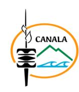

# 26-0846 - Directeur des services techniques

<a href="https://data.gouv.nc/explore/dataset/avis-de-vacances-de-poste-avp-drhfpnc/files/8cbd9ce4b1c4b85e16a2364b6f528c7a/download/" target="_blank" style="display: inline-block; padding: 8px 16px; background-color: #3f51b5; color: white; text-decoration: none; border-radius: 4px;">📄 Télécharger le PDF original</a>

<!--

-->

# DIRECTEUR DES SERVICES TECHNIQUES

!!! success "📋 Candidature rapide"
    **Date limite :** 2026-06-25  
    **Direction :** DRHFPNC  
    **Domaine :** Equipement  
    **Statut :** 📋 En cours

**Conseiller la direction et les élus / responsables sur les questions techniques**

**Référence : 3134-26-0846/SR du 2026-06-05**

## 🏢 Employeur

**Corps ou cadre d'emploi / Domaine :** Technicien / Equipement

**Durée de résidence exigée Direction :** SERVICE TECHNIQUE

**Pour le recrutement sur titre (1) :** /

**Lieu de travail :** THIO

**Poste à pourvoir :** immédiatement

**Durée du contrat :** 1 an renouvelable **Date de dépôt de l'offre :** vendredi 2026-06-05

**Date limite de candidature :** vendredi 2026-06-26

Détails de l'offre :

**Emploi RESPNC : Directeur des services techniques**

# Missions 
Sous l'autorité du Maire et du Secrétaire général, le/la Directeur(trice) des Services Techniques assure la coordination, l'organisation et le pilotage des services techniques de la collectivité pour contribuer à une qualité des services publics locaux (eau, ordure ménagères, voierie, école, espaces verts, fourniture électrique, habitat…)

# Activités principales

- Conseiller l'Exécutif et les conseillers sur les questions techniques ;
- Participer à l'élaboration et à la mise en œuvre de la politique municipale en matière de services publics locaux ;
- Mettre en œuvre la politique d'investissement de la commune par un taux de réalisation de bon niveau grâce à l'utilisation d'outils (PPI, APC/CP, études)
- Encadrer, former et manager les équipes administrative, bâtiments, voirie, espaces verts, de l'eau dans un objectif de performance (20 agents) ;
- Préparer et exécuter le budget de la direction des services techniques ;
- Veiller au respect des normes de sécurité, d'hygiène et de réglementation ;
- Assurer le suivi des prestataires et partenaires extérieurs ;
- Participer à la gestion de crise ;
- Assurer la gestion du patrimoine de la commune

# Caractéristiques particulières de l'emploi 
- Sollicitation en dehors des horaires habituels
- Gestion des conflits

#### Profil du candidat Savoir/connaissance/Diplôme exigé 
- Formation supérieure dans les domaines du bâtiment, génie civil, travaux publics, infrastructures ou équivalent ;
- Expérience significative dans un poste similaire ;
- Connaître le fonctionnement des collectivités en Nouvelle-Calédonie ;
- Savoir préparer et exécuter un budget dans les règles de l'orthodoxie budgétaire ;
- Maîtriser la conduite de projets et la maîtrise d'ouvrage public ;
- Connaître l'essentiel de la réglementation des marchés publics ;
- Savoir manager les équipes, planifier leur travail et le contrôler ;
- Savoir rendre compte à sa hiérarchie de son action ;
- Connaître la gestion des conflits et l'écosystème de Thio ;
- Savoir rédiger des courriers, des notes explicatives et des projets de délibérations ;
- Permis B exigé.

**Complémentaires :** Mairie de Thio - Le secrétariat général

Tél : [📞 44.52.20](tel:445220) mail : [✉️ mairie@mairie-thio.nc](mailto:mairie@mairie-thio.nc)

# POUR RÉPONDRE À CETTE OFFRE

Les candidatures (CV détaillé, lettre de motivation, photocopie des diplômes, fiche de renseignements et demande de changement de corps ou cadre d'emplois si nécessaire\*) précisant la référence de l'offre doivent parvenir Secrétariat de la Mairie de Thio par :

voie postale : 1 rue du Gouverneur Feuillet – 98829 Thio dépôt physique : 1 rue du Gouverneur Feuillet – 98829 Thio

mail : [✉️ mairie@mairie-thio.nc](mailto:mairie@mairie-thio.nc)

- (1) Vous trouverez la liste des pièces à fournir afin de justifier de la citoyenneté ou de la durée de résidence dans le document intitulé "Notice explicative : pièces à fournir pour justifier de votre citoyenneté ou de votre résidence" qui est à télécharger directement sur la page de garde des avis de vacances de poste sur le site de la DRHFPNC.
- (2) La fiche de renseignements, l'attestation sur l'honneur de non bénéfice de la rupture conventionnelle et la demande de changement de corps ou cadre d'emploi sont à télécharger directement sur la page de garde des avis de vacances de poste sur le site de la DRHFPNC.

Toute candidature incomplète ne pourra être prise en considération.

Les candidatures de fonctionnaires doivent être transmises sous couvert de la voie hiérarchique.
---

## 🎯 Actions rapides

- 📄 [Télécharger le PDF original](#)
- ← [Retour à l'index](./)
- 💼 [Autres offres en Equipement](../#equipement)
- 🏢 [Toutes les offres DRHFPNC](./?direction=drhfpnc)

*[DRHFPNC]: Direction des Ressources Humaines de la Fonction Publique de Nouvelle-Calédonie
