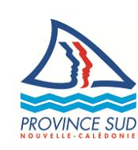

# 26-0877 - Gestionnaire de site web et graphiste éditorial

<a href="https://data.gouv.nc/explore/dataset/avis-de-vacances-de-poste-avp-drhfpnc/files/6a27e1c124544e231ec0fc5b0894a254/download/" target="_blank" style="display: inline-block; padding: 8px 16px; background-color: #3f51b5; color: white; text-decoration: none; border-radius: 4px;">📄 Télécharger le PDF original</a>

<!--

-->

## Gestionnaire de site web et graphiste éditorial

!!! success "📋 Candidature rapide"
    **Date limite :** 2026-06-25  
    **Direction :** PVS  
    **Domaine :** Autres filières  
    **Statut :** 📋 En cours

**Référence : 3134-26-0877/SR du 2026-06-05**

## 🏢 Employeur

**Corps ou Cadre d'emploi /Domaine :** Rédacteur **Direction du Système d'Information et du Numérique**

**Durée de résidence exigée pour le recrutement sur titre (1):** /

**Poste à pourvoir :** 2026-12-01

**Lieu de travail : Nouméa**

**Date de dépôt de l'offre :** vendredi 2026-06-05

**Date limite de candidature :** vendredi 2026-06-26

# Détails de l'offre 
La province Sud place l'usager au cœur de ses priorités et a pour ambition de mener une véritable stratégie client. Leader en matière d'e-administration sur le territoire, son objectif est de tendre vers une administration 100% numérique afin de moderniser, de simplifier et d'optimiser les procédures administratives et les démarches des usagers.

La direction du système d'information et du numérique de la province Sud (DSIN) tient un rôle essentiel dans la transformation opérée par la collectivité, et est responsable de la politique de développement du numérique. Sa nouvelle ambition est de faire de la donnée un axe prioritaire, et d'intégrer l'intelligence artificielle dans ses outils pour améliorer la performance de ses services.

La DSIN est une direction d'une cinquantaine de personnes, regroupées dans 4 services :

- CDS : Centre De Services (10 personnes)
- SIL : Service des Infrastructures et de la Logistique (11 personnes)
- DEVOPS : Service des Développements et des Opérations (14 personnes)
- POP : Service de la Performance Opérationnelle (12 personnes)

La direction est composée d'un directeur et d'une directrice adjointe.

Les principaux interlocuteurs du gestionnaire de site web et graphiste éditorial sont :

- Le chef de service POP
- Le chef projet digital
- Les équipes opérationnelles DEVOPS et SIL lors des développements et déploiements
- La direction (directeur + directrice adjointe)

**Emploi RESPNC : Webmestre**

## 🎯 Missions

- En qualité de gestionnaire de site web et développeur de contenu, vous façonnerez l'expérience numérique de nos usagers dans le cadre de la modernisation et de l'innovation du site internet de la province Sud ;
- En qualité de graphiste éditorial(e) pour le magazine Sudmag, vous apporterez une touche artistique à notre publication emblématique.

En tant que gestionnaire de site web et développeur de contenu, votre mission principale sera de gérer de manière globale le site internet de la province Sud. Vous devrez à la fois administrer et développer le site, ainsi que gérer le contenu pour garantir une expérience utilisateur optimale.

A ce titre, vous aurez pour missions :

- D'assurer la gestion et la maintenance technique du site web Province Sud ;
- De garantir le bon fonctionnement du site et de gérer les mises à jour, les sauvegardes et les correctifs nécessaires ;
- De concevoir et de développer de nouvelles fonctionnalités en utilisant des

langages de programmation tels que HTML, CSS, JavaScript, PHP, etc. ;

- De gérer les contenus (création, modification et publication en respectant les consignes éditoriales et graphiques) ;
- D'optimiser le référencement naturel du site web afin d'améliorer sa visibilité sur les moteurs de recherche et d'augmenter son trafic ;
- D'accompagner les directions opérationnelles dans l'utilisation du Content Management System (CMS) et l'ajout de contenu.

En tant que graphiste éditorial(e) pour le magazine Sudmag, vous serez responsable de la création visuelle, de la mise en page et de la conception graphique du magazine.

A ce titre, vous aurez pour missions :

- De créer et de réaliser la mise en page et le montage du magazine de sa conception initiale jusqu'aux différents livrables ;
- De collaborer avec les rédacteurs, les photographes, les illustrateurs et l'équipe éditoriale pour garantir le respect des objectifs éditoriaux et esthétiques ;
- De développer des gabarits et des modèles pour assurer une cohérence visuelle, ainsi que de faire évoluer la qualité d'un numéro à l'autre ;
- D'effectuer une relecture minutieuse de la mise en page pour détecter et corriger les erreurs, les fautes de frappe, les problèmes de césure ou de justification du texte.

#### Caractéristiques particulières de l'emploi 
Pourquoi nous rejoindre ?

- Pour intégrer une équipe dynamique au sein d'une collectivité en pleine transformation numérique
- Pour participer à des projets innovants ayant un impact réel sur le service public
- Pour bénéficier d'opportunités de formation continue et de développement professionnel

#### Profil du candidat Savoir / Connaissance/Diplôme exigé 
- Maîtrise des langages de développement web tels que HTML, CSS, JavaScript, et des frameworks associés
- Maîtrise des logiciels de conception graphique tels qu'Adobe Creative Suite (Photoshop, InDesign, Illustrator) ou équivalents
- Aptitudes à réaliser des retouches photos
- Maîtrise parfaite de la chaine graphique (print + web)
- Connaissances des techniques d'optimisation du référencement naturel
- Connaissances approfondies des systèmes de gestion de contenu (CMS) tels que Drupal, WordPress ou équivalents
- Connaissances des technologies de bases de données et des requêtes SQL
- Connaissances des normes et des standards du web, y compris les normes W3C
- Connaissances des tendances actuelles en matière de design et de mise en page
- Connaissances des processus d'impression et de production pour garantir une qualité de publication élevée.
- Compétences en gestion de contenu, y compris la création, la mise à jour et la publication de contenu
- Compréhension des besoins et des attentes des utilisateurs finaux
- Compréhension des processus de développement de logiciels, y compris l'analyse des exigences, la conception, la programmation et les tests
- Compréhension des principes de l'expérience utilisateur (UX) et de l'accessibilité Web
- Compréhension des principes fondamentaux de la conception graphique, de la typographie et de la composition visuelle
- Compréhension de la chaîne de production photographique (lieu, matériel, etc)
- Maîtrise des technologies 3D et vidéo serait appréciées

### Savoir-faire 
- Capacité à créer et à développer de nouvelles pages web et d'espaces en utilisant les technologies web modernes pour répondre aux besoins des directions métiers
- Capacité à gérer techniquement le site web, y compris la maintenance, les mises à jour, l'optimisation des performances et la résolution des problèmes techniques
- Capacité à gérer du contenu, y compris la structuration du contenu, la mise à jour régulière, et l'optimisation pour l'audience cible

- Capacité à collaborer étroitement avec les directions métiers pour comprendre leurs besoins et de définir des solutions web appropriées
- Capacité à collaborer étroitement avec l'équipe éditoriale pour comprendre les exigences visuelles et les orientations créatives
- Capacité à suivre des tendances et des évolutions dans le domaine du développement web et de la gestion de contenu pour proposer des améliorations constantes
- Capacité à créer des mises en page attractives et fonctionnelles pour le magazine, en intégrant le contenu éditorial, les images et les éléments graphiques
- Capacité à développer des visuels percutants pour illustrer les articles et les reportages
- Capacité à adapter des designs en fonction des besoins spécifiques de chaque numéro du magazine
- Grande capacité à respecter des délais de production et des contraintes budgétaires

#### Comportement professionnel 
- Sens de la créativité et artistique pour concevoir des solutions web attractives et fonctionnelles et produire des designs originaux et percutants
- Capacité à travailler de manière autonome tout en étant un membre collaboratif de la DSIN et de l'équipe éditoriale
- Capacité à la communication pour interagir efficacement avec les différentes directions métiers
- Capacité à gérer efficacement le temps pour respecter les délais
- Capacité à s'adapter aux changements de contenu et aux ajustements de dernière minute
- Capacité à s'adapter aux changements technologiques et aux nouvelles exigences du secteur
- Souci du détail et de la qualité pour garantir une expérience utilisateur optimale et une publication visuellement impeccable

#### Contact et informations complémentaires 
Pour tout renseignement complémentaire, vous pouvez contacter Mme Laure Siret – Chef de service de la performance opérationnelle - Tél. : [📞 20 32 71](tel:203271) / e-mail : [✉️ laure.siret@province-sud.nc](mailto:laure.siret@province-sud.nc).

Vous pouvez consulter l'ensemble des AVP sur le site de la DRHFPNC (www.drhfpnc.gouv.nc) ainsi que la réglementation et le répertoire des emplois (RESPNC). Le présent AVP est également consultable sur le site de la province Sud - (www.province-sud.nc)

# POUR RÉPONDRE À CETTE OFFRE

Les candidatures (CV détaillé, lettre de motivation, photocopie des diplômes, fiche de renseignements, attestation sur l'honneur de non bénéfice de la rupture conventionnelle, ainsi que la demande de changement de corps ou cadre d'emplois si nécessaire (2)) précisant la référence de l'offre doivent parvenir à la direction des ressources humaines par :

- Soit par internet : <https://www.province-sud.nc/avpweb/app/avis-vacance-de-poste>
- Mail : [drh.candidatures@province-sud.nc](mailto:drh.candidatures@province-sud.nc)
- Voie postale : Bureau du recrutement BP L1 98849 Nouméa cedex
- Dépôt physique : Centre administratif de la province Sud 6 route des artifices Nouméa
- Fax : [📞 20.30.12](tel:203012)

(1)Vous trouverez la liste des pièces à fournir afin de justifier de la citoyenneté ou de la durée de résidence dans le document intitulé "Notice explicative : pièces à fournir pour justifier de votre citoyenneté ou de votre résidence" qui est à télécharger directement sur la page de garde des avis de vacances de poste sur le site de la DRHFPNC.

(2)La fiche de renseignements et la demande de changement de corps ou cadre d'emploi sont à télécharger directement sur la page de garde des avis de vacances de poste sur le site de la DRHFPNC. Toute candidature incomplète ne pourra être prise en considération.
---

## 🎯 Actions rapides

- 📄 [Télécharger le PDF original](#)
- ← [Retour à l'index](./)
- 💼 [Autres offres en Autres filières](../#autres-filieres)
- 🏢 [Toutes les offres DRHFPNC](./?direction=pvs)

*[DRHFPNC]: Direction des Ressources Humaines de la Fonction Publique de Nouvelle-Calédonie
*[AVP]: Avis de Vacance de Poste
