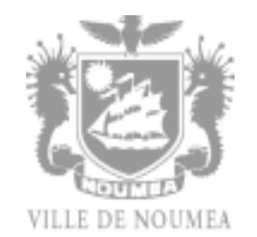

# 26-0954 - 3 Auxiliaires de puériculture en néonatalogie

<a href="https://data.gouv.nc/explore/dataset/avis-de-vacances-de-poste-avp-drhfpnc/files/0cc54a907622373628b95c99265ecc92/download/" target="_blank" style="display: inline-block; padding: 8px 16px; background-color: #3f51b5; color: white; text-decoration: none; border-radius: 4px;">📄 Télécharger le PDF original</a>

<!--

-->

## 3 Auxiliaires de puériculture en néonatalogie

!!! success "📋 Candidature rapide"
    **Date limite :** 2026-07-09  
    **Direction :** CHT  
    **Domaine :** Aide-soignant  
    **Statut :** 📋 En cours

**Référence : 3134-26-0954/SR du 2026-06-19**

## 🏢 Employeur

**Corps /Domaine :** Auxiliaire de puériculture / Statut

particulier des personnels paramédicaux

**Durée de résidence exigée pour le recrutement sur**

**titre (1) :** au moins égale à 3 ans

**Poste à pourvoir :** Immédiatement

**Direction de la coordination des soins**

**Lieu de travail : Médipôle Koutio**

**Date de dépôt de l'offre :** Vendredi 2026-06-19

**Date limite de candidature :** Vendredi 2026-07-10

# Détails de l'offre : Service de néonatalogie

## À propos du poste 
L'auxiliaire de puériculture dispense, en collaboration avec l'infirmier (en soins généraux, en puériculture) ou avec la sage-femme, et sous leur responsabilité, des soins de prévention, de maintien, de relation et d'éducation à la santé, pour préserver et restaurer la continuité de la vie, le bien-être et l'autonomie du nouveau-né.

**Pour en savoir plus sur notre établissement et le service de néonatalogie, cliquez sur le lien suivant :** [Découvrez](https://recrutement.cht.nc/pages/decouvrez-le-medipole) le [Médipôle](https://recrutement.cht.nc/pages/decouvrez-le-medipole) - CHT Gaston Bourret

## Missions 
- Réalisation des soins d'hygiène, de sécurité, de confort et de bien-être au nouveau-né et à sa mère, dans son champ de compétence,
- Aide à la puéricultrice, à l'infirmière ou à la sage-femme lors des soins,
- Observation et recueil de données sur l'état de santé et le comportement relationnel du couple mère/enfant,
- Transmissions des observations par oral et par écrit pour le maintien de la continuité des soins,
- Entretien de l'environnement immédiat du nouveau-né prématuré,
- Observation du bon fonctionnement des appareillages et dispositifs médicaux, entretien du matériel de soins et gestion des stocks
- Accueil, information, accompagnement et éducation de l'entourage du nouveau-né (parents, famille, usagers, etc.),
- Accueil, information et formation des personnels nouvellement recrutés et des apprenants (élèves, stagiaires),
- Aide et accompagnement dans les activités de la vie quotidienne

#### Profil du candidat 
- **- Diplôme d'Etat d'Auxiliaire en puériculture**
- **- Expérience requise d'un an minimum en service de néonatalogie (maternité type 3)**
- Bio-nettoyage et hygiène des locaux,
- Hygiène hospitalière,
- Gestes et postures Manutention,
- Attestation de formation aux gestes et soins d'urgence de niveau 2

## Conditions de travail et avantages 
- Travail en horaires adaptés à l'activité du service (week-ends, nuit, jours fériés et chômé)
- Primes spécifique (nuit, week-end…) selon statut
- Grilles indiciaires de la fonction publique de Nouvelle-Calédonie (Grille salariale de la santé de [Nouvelle](https://drhfpnc.gouv.nc/sites/default/files/atoms/files/sante_0.pdf) [Calédonie\)](https://drhfpnc.gouv.nc/sites/default/files/atoms/files/sante_0.pdf)

#### ℹ **Contact et informations complémentaires :**

Pour toutes informations supplémentaires, veuillez contacter Céline MERIADEC -*Cadre sage-femme supérieur - tél : [📞 20.80.00](tel:208000) – poste 8316 - mail : [✉️ celine.meriadec@cht.nc](mailto:celine.meriadec@cht.nc)*

## POUR RÉPONDRE À CETTE OFFRE

Les candidatures **(CV détaillé, lettre de motivation, photocopie des diplômes)** doivent nous parvenir prioritairement en ligne via notre plateforme **Teamtailor** :

## 3 auxiliaires de puériculture en [néonatalogie](https://recrutement.cht.nc/jobs/7905143-3-auxiliaires-de-puericulture-en-neonatalogie) - CHT Gaston Bourret

En cas d'impossibilité de candidater en ligne, les candidatures pourront nous parvenir par message électronique, en précisant la référence de l'offre, à l'adresse suivante

- Mail : *[✉️ recrutement@cht.nc](mailto:recrutement@cht.nc)*

(1)Vous trouverez la liste des pièces à fournir afin de justifier de la citoyenneté ou de la durée de résidence dans le document intitulé "Notice explicative : pièces à fournir pour justifier de votre citoyenneté ou de votre résidence" qui est à télécharger directement sur la page de garde des avis de vacances de poste sur le site de la DRHFPNC.

*Les candidatures de fonctionnaires doivent être transmises sous couvert de la voie hiérarchique*
---

## 🎯 Actions rapides

- 📄 [Télécharger le PDF original](#)
- ← [Retour à l'index](./)
- 💼 [Autres offres en Aide-soignant](../#aide-soignant)
- 🏢 [Toutes les offres DRHFPNC](./?direction=cht)

*[DRHFPNC]: Direction des Ressources Humaines de la Fonction Publique de Nouvelle-Calédonie
*[CHT]: Centre Hospitalier Territorial
