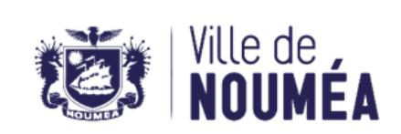

# 26-0963 - Assistant(e) social(e)

<a href="https://data.gouv.nc/explore/dataset/avis-de-vacances-de-poste-avp-drhfpnc/files/200fbdb7257f26492d0c4b341d3e7309/download/" target="_blank" style="display: inline-block; padding: 8px 16px; background-color: #3f51b5; color: white; text-decoration: none; border-radius: 4px;">📄 Télécharger le PDF original</a>

<!--

-->

## Assistant(e) social(e)

!!! success "📋 Candidature rapide"
    **Date limite :** 2026-07-16  
    **Direction :** PVS  
    **Domaine :** Autres filières  
    **Statut :** 📋 En cours

**Référence : 3134-26-0963/SR du 2026-06-26**

## 🏢 Employeur

**Corps ou Cadre d'emploi /Domaine :** Assistant socio-éducatif – spécialité assistant de service social

**Durée de résidence exigée**

**pour le recrutement sur titre (1):** au moins égale à 5 ans

**Poste à pourvoir :** 2026-09-01

### Direction Provinciale de l'Action Sanitaire et Sociale

**Lieu de travail :** Nouméa et Grand Nouméa

**Date de dépôt de l'offre :** vendredi 2026-06-26

**Date limite de candidature :** vendredi 2026-07-17

## Détails de l'offre 
La direction de l'action sanitaire et sociale de la province Sud (DPASS), rattachée au pôle développement et épanouissement de la personne, exerce son action sur l'ensemble du territoire provincial, au sein des services centraux, des unités provinciales d'action sanitaire et sociale (UPASS), des centres médico-sociaux (CMS) et des autres sites excentrés.

Grâce à ce maillage territorial, les services de la DPASS, répartis en 4 pôles fonctionnels, contribuent dans une dynamique de synergie médico-sociale à offrir des prestations de santé publique, à mener des actions de prévention et de promotion de la santé, à permettre l'accès aux soins, à répondre aux difficultés sociales, à soutenir et à accompagner les établissements médico-sociaux, et à prendre en charge les difficultés intrafamiliales.

Au sein du pôle des solidarités, le service de l'action sociale (SAS) comprend plus de 35 agents permanents assurant un maillage de l'ensemble du territoire de la province Sud.

**Emploi RESPNC : Travailleur social**

## 🎯 Missions

- D'accueillir les personnes et les familles en difficulté ou fragilisées dans leurs différentes dimensions, dans le cadre de permanences sociales ou lors des permanences d'accueil exceptionnel (PAE) ;
- De concourir pleinement et activement à la protection de l'enfance ;
- D'évaluer les situations sociales et de mettre en œuvre avec les intéressés, les plans d'accompagnement en engageant les interventions de médiation nécessaires ;
- D'accompagner et de soutenir les populations vulnérables par le biais d'interventions à domicile et des actions de terrain ;
- D'engager la mise en œuvre des projets d'insertion sociale les plus adaptés dans un environnement multi référentiel (logement, emploi, santé, assurance et accès aux droits) ;
- De participer activement à l'élaboration et à la mise en œuvre de projets portés par son service et par sa direction ;
- De participer à la réflexion et à la mise en place des projets territoriaux ;
- De participer aux actions de prévention ou de formation dans le cadre d'une synergie médico-sociale ;
- D'initier et/ou de collaborer à la concrétisation d'actions collectives ;
- De contribuer à la démarche de professionnalisation des stagiaires assistants de service social.

**Caractéristiques particulières de l'emploi :**

Le ou la candidat(e) retenu(e) aura vocation à exercer sur les différents secteurs de l'agglomération (Nouméa et Grand Nouméa), en secteur excentré, en fonction des besoins prioritaires du service.

#### Profil du candidat Savoir / Connaissance/Diplôme exigé 
- Titulaire du diplôme d'État d'assistant de service social
- Bonnes connaissances de l'environnement institutionnel et socio-culturel de la Nouvelle-Calédonie
- Titulaire du permis B

#### Savoir-faire 
- Mise en place de plan d'accompagnement
- Maîtrise des écrits professionnels
- Maîtrise de l'outil informatique
- Capacité à impulser des actions de groupe
- Approche individuelle et collective du travail social

#### Comportement professionnel 
- Sens du travail en équipe et en réseau
- Respect des règles déontologiques
- Démarche de veille professionnelle
- Prises d'initiatives

#### Contact et informations complémentaires 
Pour tout renseignement complémentaire, vous pouvez contacter M. Denis BREANT – Chef du service de l'action sociale - Tél. : [📞 20 45 50](tel:204550) / e-mail : [✉️ denis.breant@province-sud.nc](mailto:denis.breant@province-sud.nc).

Vous pouvez consulter l'ensemble des AVP sur le site de la DRHFPNC (www.drhfpnc.gouv.nc) ainsi que la réglementation et le répertoire des emplois (RESPNC). Le présent AVP est également consultable sur le site de la province Sud - (www.province-sud.nc)

# POUR RÉPONDRE À CETTE OFFRE

Les candidatures (CV détaillé, lettre de motivation, photocopie des diplômes, fiche de renseignements, attestation sur l'honneur de non bénéfice de la rupture conventionnelle, ainsi que la demande de changement de corps ou cadre d'emplois si nécessaire (2)) précisant la référence de l'offre doivent parvenir à la direction des ressources humaines par :

- Soit par internet : <https://www.province-sud.nc/avpweb/app/avis-vacance-de-poste>
- Mail : [drh.candidatures@province-sud.nc](mailto:drh.candidatures@province-sud.nc)
- Voie postale : Bureau du recrutement BP L1 98849 Nouméa cedex
- Dépôt physique : Centre administratif de la province Sud 6 route des artifices Nouméa
- Fax : [📞 20.30.12](tel:203012)

(1)Vous trouverez la liste des pièces à fournir afin de justifier de la citoyenneté ou de la durée de résidence dans le document intitulé "Notice explicative : pièces à fournir pour justifier de votre citoyenneté ou de votre résidence" qui est à télécharger directement sur la page de garde des avis de vacances de poste sur le site de la DRHFPNC.

(2)La fiche de renseignements et la demande de changement de corps ou cadre d'emploi sont à télécharger directement sur la page de garde des avis de vacances de poste sur le site de la DRHFPNC. Toute candidature incomplète ne pourra être prise en considération.

*Les candidatures de fonctionnaires doivent être transmises sous couvert de la voie hiérarchique*
---

## 🎯 Actions rapides

- 📄 [Télécharger le PDF original](#)
- ← [Retour à l'index](./)
- 💼 [Autres offres en Autres filières](../#autres-filieres)
- 🏢 [Toutes les offres DRHFPNC](./?direction=pvs)

*[DRHFPNC]: Direction des Ressources Humaines de la Fonction Publique de Nouvelle-Calédonie
*[DPASS]: Direction Provinciale de l'Action Sanitaire et Sociale
*[UPASS]: Unité Provinciale d'Action Sanitaire et Sociale
*[AVP]: Avis de Vacance de Poste
