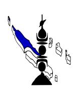

# 26-0966 - Infirmier(e)

<a href="https://data.gouv.nc/explore/dataset/avis-de-vacances-de-poste-avp-drhfpnc/files/caed74bc4afa6ded013046e5424609ed/download/" target="_blank" style="display: inline-block; padding: 8px 16px; background-color: #3f51b5; color: white; text-decoration: none; border-radius: 4px;">📄 Télécharger le PDF original</a>

<!--

-->

## Infirmier(e)

!!! success "📋 Candidature rapide"
    **Date limite :** 2026-07-16  
    **Direction :** CHN  
    **Domaine :** Infirmiers  
    **Statut :** 📋 En cours

**Référence : 3134-26-0966/SR du 2026-06-26**

## 🏢 Employeur

**Corps ou Cadre d'emploi / Domaine :** Infirmier en Soins **Direction : Centre Hospitalier du Nord**

Généraux

**Lieu de travail :** Raymond Douï Nébayes de Poindimié

**Durée de résidence exigée**

**pour le recrutement sur titre (1) :** au moins égale à 5 ans **Date de dépôt de l'offre :** Vendredi 2026-06-26

**Poste à pourvoir :** immédiatement **Date limite de candidature :** Vendredi 2026-07-17

Détails de l'offre :

**Emploi RESPNC : Infirmier**

## 🎯 Missions

à promouvoir, maintenir et restaurer la santé.

- Contribuer à l'éducation, à la santé et à l'accompagnement des personnes hospitalisées dans leur parcours de soins en lien avec leur projet de vie.

**Caractéristiques particulières de l'emploi :**

Planning de travail : - Roulement en 12 heures

- Polyvalence Jour-Nuit

Poste à temps plein

**Profil du candidat Savoir / Connaissance/Diplôme exigé :**

Soins infirmiers

- Méthode de recherche en soins

- Médicales générales et/ou scientifiques en fonction du domaine d'activité
- Droit des patients
- Gestes et postures-manutention
- Gestion du stress
- Hygiène hospitalière
- Communication et relation d'aide
- Méthodologie d'analyse de situation d'urgences spécifiques à son domaine de compétence et définir les actions.
- Analyser/évaluer la situation clinique d'une personne, d'un groupe de personnes, relative à son domaine de compétence.
- Etre titulaire du diplôme d'état infirmier

## Savoir-faire 
- Eduquer, conseiller le patient et son entourage dans le cadre du projet de soins.
- Analyser, synthétiser des informations permettant la prise en charge de la personne soignée et la continuité des soins.
- Identifier, analyser, évaluer et prévenir les risques relevant de son domaine, définir les actions correctives/préventives.
- Conduire un entretien d'aide.
- Elaborer et formaliser un diagnostic santé de la personne, relatif à son domaine de compétence.
- Concevoir, formaliser et adapter des procédures/protocoles/modes opératoires/consignes relatives à son domaine de compétence.
- Evaluer les pratiques professionnelles de soins sans son domaine de compétence.
- Identifier/analyser des situations

## Comportement professionnel 
- Disponibilité
- Autonomie
- Respect
- Sens de l'organisation
- Esprit de synthèse et d'analyse
- Esprit d'équipe

**Contact et informations complémentaires :**

Pour tout renseignement complémentaire vous pouvez contacter la Direction des Ressources Humaines tél : [📞 42.65.16](tel:426516) ou la Coordinatrice des Soins – tél : [📞 42.65.85](tel:426585)/ [📞 42.11.15](tel:421115) / mail : [✉️ recrutement@chn.nc](mailto:recrutement@chn.nc)*.*

## POUR RÉPONDRE À CETTE OFFRE

Les candidatures (CV détaillé, lettre de motivation, photocopie des diplômes, fiche de renseignements, attestation sur l'honneur de non bénéfice de la rupture conventionnelle, ainsi que la demande de changement de corps ou cadre d'emplois si nécessaire (2)) précisant la référence de l'offre doivent parvenir au Centre Hospitalier du Nord par :

- Voie postale : Pôle Sanitaire du Nord BP 688 98860 KONE.
- Dépôt physique (Secrétariat de direction, Pôle Sanitaire du Nord, rue Jimmy WELEPANE derrière la Province Nord à Paiamboué)
- Mail : [recrutement@chn.nc](mailto:recrutement@chn.nc)
- Fax (n° [📞 42 11 90](tel:421190))

(1)Vous trouverez la liste des pièces à fournir afin de justifier de la citoyenneté ou de la durée de résidence dans le document intitulé "Notice explicative : pièces à fournir pour justifier de votre citoyenneté ou de votre résidence" qui est à télécharger directement sur la page de garde des avis de vacances de poste sur le site de la DRHFPNC.

(2)La fiche de renseignements et la demande de changement de corps ou cadre d'emploi sont à télécharger directement sur la page de garde des avis de vacances de poste sur le site de la DRHFPNC.

Toute candidature incomplète ne pourra être prise en considération.

*Les candidatures de fonctionnaires doivent être transmises sous couvert de la voie hiérarchique*
---

## 🎯 Actions rapides

- 📄 [Télécharger le PDF original](#)
- ← [Retour à l'index](./)
- 💼 [Autres offres en Infirmiers](../#infirmiers)
- 🏢 [Toutes les offres DRHFPNC](./?direction=chn)

*[DRHFPNC]: Direction des Ressources Humaines de la Fonction Publique de Nouvelle-Calédonie
*[CHN]: Centre Hospitalier du Nord
