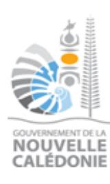

# 26-1004 - Chef(fe) du service de la gestion financière et des achats

<a href="https://data.gouv.nc/explore/dataset/avis-de-vacances-de-poste-avp-drhfpnc/files/888aed01565bd888a1c38fed23f9ac3c/download/" target="_blank" style="display: inline-block; padding: 8px 16px; background-color: #3f51b5; color: white; text-decoration: none; border-radius: 4px;">📄 Télécharger le PDF original</a>

<!--

-->

## Chef(fe) du service de la gestion financière et des achats

!!! success "📋 Candidature rapide"
    **Date limite :** 2026-07-23  
    **Direction :** CNC  
    **Domaine :** Autres filières  
    **Statut :** 📋 En cours

**Référence : 3134-26-1004/SR du 2026-07-03**

## 🏢 Employeur

**Corps /Domaine :** Attaché **Direction : de la gestion financière**

**Durée de résidence exigée pour le recrutement sur titre :** / **Lieu de travail :** Nouméa

**Poste à pourvoir :** Susceptible d'être à pourvoir **Date de dépôt de l'offre :** Vendredi 2026-07-03

**Date limite de candidature :** Vendredi 2026-07-24

Placé(e) sous l'autorité du directeur de la gestion financière, le/la chef(fe) du service de la gestion financière et des achats participe au pilotage de la chaîne budgétaire, comptable et financière du congrès de la Nouvelle-Calédonie.

Il/Elle contribue à la préparation, à l'exécution et au suivi du budget de l'institution. Il/Elle assure le contrôle de l'exécution des dépenses, participe à la sécurisation des procédures budgétaires, comptables et financières, et veille à la qualité du traitement des dossiers relevant de son périmètre.

Il/Elle intervient également dans le domaine des achats et de la commande publique, en lien avec les besoins des services, les règles applicables et les outils de gestion utilisés par l'institution.

Le/La chef(fe) de service encadre, anime et coordonne l'équipe placée sous sa responsabilité. Il/Elle contribue au développement des outils de suivi, de reporting et d'analyse financière, ainsi qu'à l'amélioration continue des processus, notamment dans le cadre de la dématérialisation de la chaîne financière.

Il/Elle travaille en relation avec les directions et services du congrès, la Paierie de la Nouvelle-Calédonie, les fournisseurs, les prestataires et les partenaires institutionnels intervenant dans les circuits budgétaires, comptables et financiers.

**Emploi RESPNC : responsable financier**

- **Missions :** Participer à la préparation, à l'exécution et au suivi budgétaire et comptable du budget du congrès ;
  - Assurer le contrôle de l'exécution des dépenses et contribuer à la sécurisation de la chaîne de la dépense ;
  - Participer au suivi des engagements, liquidations, mandatements et opérations budgétaires relevant du service ;
  - Contribuer à la gestion des achats, des commandes et des procédures relevant de la commande publique ;
  - Assurer le suivi de la comptabilité analytique et participer à l'exploitation des données budgétaires, financières et comptables ;
  - Produire des analyses, tableaux de bord, indicateurs et reporting destinés à la direction et à la hiérarchie ;
  - Contribuer au suivi des délais de traitement, à la fiabilisation des données et au contrôle de cohérence des informations issues des outils métiers ;
  - Participer au développement, à l'adaptation et à l'amélioration des outils métiers utilisés par la direction, notamment SURFI et les outils bureautiques associés ;

- Participer aux projets de dématérialisation, d'interfaçage applicatif et d'amélioration continue des processus financiers ;
- Encadrer, animer et coordonner l'équipe placée sous sa responsabilité ;
- Apporter un appui technique et un rôle de conseil dans les domaines budgétaire, comptable, financier et de la commande publique ;
- Assurer, le cas échéant, l'intérim du directeur de la gestion financière en cas d'absence ou d'empêchement.

#### Caractéristiques particulières de l'emploi 
Le poste implique une bonne connaissance de l'environnement des finances publiques, des circuits budgétaires et comptables, ainsi qu'une capacité à travailler en transversalité avec les services, les prestataires et les partenaires institutionnels.

Il nécessite une forte capacité d'adaptation aux outils métiers financiers et documentaires, ainsi qu'une participation active aux projets de dématérialisation, de fiabilisation des données, de développement des outils de suivi et d'amélioration des procédures internes de la direction.

Le/La titulaire du poste peut être amené(e) à participer à l'organisation des séances solennelles et des manifestations organisées au sein du congrès de la Nouvelle-Calédonie.

### Profil du candidat 
#### Savoir /Connaissance/Diplôme exigé 
- Formation Bac +3 souhaitée ou expérience confirmée dans le domaine budgétaire, comptable, financier ou de la commande publique ;
- Bonne connaissance de l'environnement des finances publiques ;
- Maîtrise des règles budgétaires et comptables applicables aux collectivités publiques ;
- Maîtrise de la chaîne de la dépense publique ;
- Connaissance des règles de gestion publique et de comptabilité publique ;
- Connaissance de la réglementation relative à la commande publique ;
- Connaissance des règles juridiques de base en droit public ;
- Connaissance des principes de contrôle interne financier et de sécurisation des procédures ;
- Maîtrise des outils bureautiques, notamment les tableurs, bases de données et outils de reporting ;
- Connaissance ou capacité d'appropriation rapide des applications métiers financières et documentaires, notamment SURFI, GEEC et ZEDOC ;
- Conduite de projet ;
- Principes du management

#### Savoir-faire 
- Manager une équipe ;
- Organiser, planifier et prioriser l'activité d'un service ;

- Analyser des données budgétaires, financières et comptables ;
- Produire des tableaux de bord, indicateurs et outils d'aide à la décision ;
- Fiabiliser les données et contrôler la cohérence des informations issues des outils métiers ;
- Participer à la conception, à l'amélioration ou à l'évolution d'outils de gestion ;
- Contribuer à des projets de dématérialisation, d'interfaçage applicatif et d'amélioration continue ;
- Utiliser et maîtriser les applications informatiques métiers financières et documentaires ;
- Maîtriser la communication interne et externe ;
- Rédiger des notes, synthèses, procédures et documents de suivi ;
- Gérer et hiérarchiser les urgences ;
- Aider à la prise de décision ;
- Travailler en transversalité avec les services, les prestataires et les partenaires institutionnels ;
- Être force de proposition.

### Comportement professionnel 
- Rigueur ;
- Fiabilité ;
- Discrétion professionnelle ;
- Sens des responsabilités ;
- Esprit d'analyse et de synthèse ;
- Diplomatie ;
- Sens de la communication ;
- Réactivité ;
- Qualités relationnelles ;
- Sens du service public ;
- Capacité d'adaptation ;
- Capacité à accompagner le changement ;
- Travail en équipe ;
- Disponibilité ;
- Neutralité.

**Contact et informations complémentaires :**

Joseph TUI, Directeur de la gestion financière du congrès de la

Nouvelle-Calédonie,

Téléphone : [📞 05.20.14](tel:052014) - Mail : [formation-recrutement-drh@congres.nc](mailto:formation-recrutement-drh@congres.nc)

# POUR RÉPONDRE À CETTE OFFRE

Les candidatures (CV détaillé, lettre de motivation, photocopie des diplômes, fiche de renseignements et demande de changement de corps ou cadre d'emplois si nécessaire (2)) précisant la référence de l'offre doivent parvenir à la direction des services de la gestion des ressources humaines du congrès de la Nouvelle-Calédonie par :

- Voie postale : BP 3 – 98 851 NOUMEA CEDEX - Dépôt physique : 1, boulevard Vauban – Centre-ville - Mail : [formation-recrutement-drh@congres.nc](mailto:formation-recrutement-drh@congres.nc)

(1)Vous trouverez la liste des pièces à fournir afin de justifier de la citoyenneté ou de la durée de résidence dans le document intitulé "Notice explicative : pièces à fournir pour justifier de votre citoyenneté ou de votre résidence" qui est à télécharger directement sur la page de garde des avis de vacances de poste sur le site de la DRHFPNC.

(2)La fiche de renseignements et la demande de changement de corps ou cadre d'emploi sont à télécharger directement sur la page de garde des avis de vacances de poste sur le site de la DRHFPNC. Toute candidature incomplète ne pourra être prise en considération.

*Les candidatures de fonctionnaires doivent être transmises sous couvert de la voie hiérarchique*
---

## 🎯 Actions rapides

- 📄 [Télécharger le PDF original](#)
- ← [Retour à l'index](./)
- 💼 [Autres offres en Autres filières](../#autres-filieres)
- 🏢 [Toutes les offres DRHFPNC](./?direction=cnc)

*[DRHFPNC]: Direction des Ressources Humaines de la Fonction Publique de Nouvelle-Calédonie
