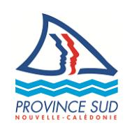

# 26-1228 - Responsable des équipes piscines

<a href="https://data.gouv.nc/explore/dataset/avis-de-vacances-de-poste-avp-drhfpnc/files/dea2510ef7a0bd6abd3c08099a13d0cd/download/" target="_blank" style="display: inline-block; padding: 8px 16px; background-color: #3f51b5; color: white; text-decoration: none; border-radius: 4px;">📄 Télécharger le PDF original</a>

<!--

-->

### Référence : 3134-26-1228/SR du 2026-08-14

### Employeur : Mairie de Nouméa

**Corps ou Cadre d'emploi / Domaine :** éducateur des activités physiques et sportives

**Durée de résidence exigée pour le recrutement sur titre : /**

**Poste à pourvoir :** Immédiatement

**Direction :** de la vie citoyenne, éducative et sportive

**Service :** municipal des sports

**Lieu de travail :** Toutes les piscines municipales

**Date de dépôt de l'offre :** Vendredi 2026-08-14

**Date limite de candidature :** Vendredi 2026-09-04

## Détails de l'offre 

!!! success "📋 Candidature rapide"
    **Date limite :** 2026-09-04  
    **Direction :** DRHFPNC  
    **Domaine :** Autres filières  
    **Statut :** 📋 En cours

La ville de Nouméa et ses 1 500 collaborateurs sont engagés quotidiennement au service des 86 000 Nouméens. Ils œuvrent au développement de la Ville avec plus de 200 équipements et services en lien avec les nombreux domaines de compétence dévolus à la commune.

Placée sous l'autorité du secrétaire général adjoint en charge du pôle vie locale, la direction de la vie citoyenne, éducative et sportive a pour mission générale de développer une offre de services en adéquation avec les besoins des citoyens sur tous les instants de leur vie, de renforcer l'accessibilité et la proximité du service public et de proposer des actions citoyennes, éducatives et sportives. Elle est composée de 4 services :

- Service coordination administrative et financière,
- Service de la vie citoyenne,
- Service de la vie éducative,
- Service municipal des sports.

Au sein de la direction, le service municipal des sports est composé de 2 sections « piscines » et « animations sportives ». Il est notamment chargé de pérenniser et développer les dispositifs d'insertion par le sport comme vecteur d'intégration sociale.

## 🎯 Missions

Il est notamment chargé de :

- Assurer et participer à la sécurité des usagers, la surveillance des bassins et l'animation de l'établissement ;
- Coordonner les maîtres-nageurs sauveteurs pour la réalisation de leurs missions en lien étroit avec le chef de la section piscines ;
- Assurer l'application du protocole de nettoyage de l'établissement ;
- Participer à la gestion et à la création des plannings des usagers de la piscine en collaboration avec le chef de la section piscines ;
- Assurer des missions de reporting ainsi qu'une veille sur la gestion des stocks auprès du chef de la section piscines ;
- Assurer l'enseignement des activités aquatiques et le suivi du matériel pédagogique ;
- Contrôler les caractéristiques de l'eau et, le cas échéant, participer à la manipulation technique des filtres, pompes, chlorinateur, chaudière, vannes de vidange et tout autre équipement de la salle des machines ;
- Gérer du matériel et des produits de traitement des eaux ;
- Appliquer la réglementation en vigueur au sein de l'établissement et celle relative aux activités aquatiques.

L'agent retenu sera amené à travailler en soirée, certains week-ends et jours fériés et pourra également, en cas de besoin et sur ordre de la hiérarchie, venir en renfort des autres personnels du service.

### Profil du candidat Savoir / Connaissance / Diplôme exigé 
- Les candidats devront impérativement être titulaires du Brevet Professionnel Jeunesse, Education Populaire et Sport Activités Aquatiques et de la Natation (BPJEPS AAN) ou équivalent ;
- Être titulaire de la carte professionnelle de Nouvelle-Calédonie conformément à la loi de pays 2023-7 du 2023-07-10 ;
- BPJEPS Activités Gymniques de la Forme et de la Force (AGFF) (mentions C et D) apprécié ;
- Techniques et pédagogie des activités physiques et sportives ;
- Caractéristiques et spécificités des différents publics ;
- Environnement juridique et réglementaire du domaine d'activités et des établissements recevant du public ;
- Techniques de communication ;
- Outils de bureautique ;
- Expérience professionnelle sur un poste similaire appréciée ;
- Appliquer et faire appliquer la réglementation en vigueur.

### Contact et informations complémentaires 
Monsieur Alexandre HENRARD, chef du service municipal des sports Tél : [📞 23.26.50](tel:232650) - Mail : [alexandre.henrard@ville-noumea.nc](mailto:alexandre.henrard@ville-noumea.nc)

# POUR RÉPONDRE À CETTE OFFRE

Votre candidature doit **obligatoirement** comporter les documents suivants :

- Une lettre de motivation ;
- Un curriculum vitae (CV) détaillé ;
- La fiche de renseignements dûment complétée à [télécharger](https://drhfpnc.gouv.nc/sites/default/files/atoms/files/recrutement_-_fiche_de_renseignements_candidature_vf_0.pdf) ici (site DRHFPNC) ;
- L'attestation sur l'honneur de non bénéfice de la rupture conventionnelle à [télécharger](https://drhfpnc.gouv.nc/sites/default/files/atoms/files/attestation_sur_lhonneur_de_non_benefice_de_la_rupture_conventionnelle.pdf) ici (site DRHFPNC) ;
- La photocopie des diplômes ;
- Pour les fonctionnaires, l'arrêté de dernière situation administrative ;
- Les justificatifs concernant la citoyenneté ou la durée de résidence *si nécessaire* (liste des pièces à fournir dans le document "notice explicative" à [télécharger](https://drhfpnc.gouv.nc/sites/default/files/atoms/files/notice_explicative_emploi_local.pdf) ici (site DRHFPNC)) ;
- Pour les fonctionnaires, la demande de changement de corps ou cadre d'emploi *si nécessaire* (demande à [télécharger](https://drhfpnc.gouv.nc/sites/default/files/atoms/files/formulaire_de_changement_de_corps_ou_de_cadre_demploi.pdf) ici (site DRHFPNC)).

Votre candidature, précisant la référence de l'offre, doit parvenir au maire de la ville de Nouméa **prioritairement** par :

- **- mail : [mairie.recrutement@ville-noumea.nc](mailto:mairie.recrutement@ville-noumea.nc)**

En cas d'impossibilité de candidater par le biais de la messagerie électronique, les dossiers de candidatures peuvent parvenir au maire de la ville de Nouméa par :

- Voie postale : BP K1 98849 Nouméa Cedex
- Dépôt physique : 16, rue du général Mangin Nouméa

*Les candidatures de fonctionnaires doivent être transmises sous couvert de la voie hiérarchique.*
---

## 🎯 Actions rapides

- 📄 [Télécharger le PDF original](#)
- ← [Retour à l'index](./)
- 💼 [Autres offres en Autres filières](../#autres-filieres)
- 🏢 [Toutes les offres DRHFPNC](./?direction=drhfpnc)

*[DRHFPNC]: Direction des Ressources Humaines de la Fonction Publique de Nouvelle-Calédonie
