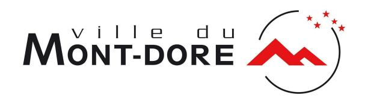

# 26-1464 - Assistant de direction à Koné

<a href="https://data.gouv.nc/explore/dataset/avis-de-vacances-de-poste-avp-drhfpnc/files/b566907adb1dfefb8dc1adcf2d785733/download/" target="_blank" style="display: inline-block; padding: 8px 16px; background-color: #3f51b5; color: white; text-decoration: none; border-radius: 4px;">📄 Télécharger le PDF original</a>

<!--

-->

**Référence : 3134-26-1464/SR du 2026-10-02**

## Employeur : Province Nord

!!! success "📋 Candidature rapide"
    **Date limite :** 2026-10-23  
    **Direction :** PVN  
    **Domaine :** Autres filières  
    **Statut :** 📋 En cours

**Corps ou Cadre d'emploi / Domaine : Rédacteur CAG**

**Durée de résidence exigée pour le recrutement sur titre (1) : /**

**Poste à pourvoir :** dès que possible

**Direction : Direction des affaires juridiques, administratives et du patrimoine**

**Lieu de travail : Koné**

**Date de dépôt de l'offre :** Vendredi 2026-10-02

**Date limite de candidature :** Vendredi 2026-10-23

## Détails de l'offre 
La DAJAP est une direction support transversale, chargée notamment de la sécurisation juridique, de l'accompagnement administratif des services et de la gestion des moyens et du patrimoine de la Province Nord. Dans un contexte de forte contrainte sur les effectifs, elle doit renforcer son organisation, la coordination de ses activités et le suivi de ses dossiers. Le recrutement d'un(e) assistant(e) de direction vise à sécuriser le fonctionnement quotidien de la direction et à faciliter la coordination et la circulation de l'information entre ses différents services et interlocuteurs. Cette fonction permet également de préserver la disponibilité de la Directrice et des encadrants pour leurs missions de pilotage, d'anticipation et d'accompagnement des services.

### Emploi RESPNC 
## 🎯 Missions

#### Activités principales 
#### Activités secondaires 
- **La personne retenue aura notamment en charge :**
- La gestion et l'optimisation de l'agenda de la Directrice et l'organisation de ses rendez-vous et réunions ;
- La préparation, la mise en forme et le suivi des dossiers et documents nécessaires à l'activité de la direction ;
- La rédaction et le suivi des courriers, notes et documents administratifs ;
- Le suivi des circuits de signature et des parapheurs ;
- La réception, le traitement et l'orientation des sollicitations adressées à la direction ;
- L'organisation matérielle et le suivi des réunions de direction ;
- La coordination et la circulation de l'information entre la Directrice, les services de la DAJAP et les interlocuteurs internes et externes ;
- Le suivi des demandes, dossiers et échéances nécessitant une relance ou une coordination entre plusieurs interlocuteurs.

- **La personne retenue aura également en charge :**
- Le classement et l'archivage des dossiers de la direction ;
- L'accueil physique et téléphonique et l'orientation des demandes vers les interlocuteurs compétents ;
- L'appui ponctuel aux services de la direction en fonction des besoins et des priorités ;
- La contribution à l'amélioration des outils et supports administratifs de la direction (trames, modèles, outils de suivi, etc.).

#### Caractéristiques particulières de l'emploi 
Fonction d'assistance directe auprès de la Directrice ; Activité nécessitant discrétion, confidentialité et réactivité ;

### Profil du candidat Savoir / Connaissance/Diplôme exigé 
- Connaissance du fonctionnement des collectivités territoriales et de leur environnement administratif ;
- Connaissance des circuits administratifs et décisionnels ;
- Maîtrise des outils bureautiques et collaboratifs ;
- Une formation ou une expérience en gestion administrative / assistanat de direction serait appréciée.

#### Savoir-faire 
- Organiser et prioriser son activité en fonction des urgences et des échéances ;
- Gérer un agenda et des réunions dans un environnement complexe ;
- Rédiger et mettre en forme des documents administratifs avec rigueur ;
- Assurer le suivi des courriers, dossiers, circuits de validation et échéances ;
- Coordonner et relancer différents interlocuteurs ; Utiliser efficacement les outils bureautiques et collaboratifs.

### Comportement professionnel 
- Rigueur et sens de l'organisation ;
- Discrétion et respect de la confidentialité ;
- Fiabilité, réactivité et constance dans le suivi des dossiers ;
- Capacité à travailler en autonomie dans un cadre hiérarchique défini ;
- Diplomatie et aisance relationnelle ;
- Sens du service et posture facilitatrice ;
- Capacité d'adaptation et esprit d'initiative.

#### Contact et informations complémentaires 
Pour tout renseignement complémentaire, vous pouvez contacter **Madame Elodie DHURES directrice des affaires juridiques, administratives et du patrimoine** - Tél : [📞 47.71.67](tel:477167)/ mail : e.dhure[s@province-nord.nc](mailto:p.domingue@province-nord.nc)

Vous pouvez consulter l'ensemble des AVP sur le site de la DRHFPNC ([www.drhfpnc.gouv.nc](http://www.drhfpnc.gouv.nc)) ainsi que la réglementation et le répertoire des emplois (RESPNC). Le présent AVP est également consultable sur le site de la province-Nord ([www.province-nord.nc\)](http://www.province-nord.nc).

# POUR RÉPONDRE À CETTE OFFRE

Les candidatures (CV détaillé, lettre de motivation, photocopie des diplômes, fiche de renseignements, attestation sur l'honneur de non bénéfice de la rupture conventionnelle, ainsi que la demande de changement de corps ou cadre d'emplois si nécessaire (2)) précisant la référence de l'offre doivent parvenir à **la Direction des Ressources Humaines (DRH) de la province Nord** par :

- Internet : <https://www.province-nord.nc/avp>
- Voie postale : BP 41 98860 Koné
- Dépôt physique : Hôtel de la province Nord 41 avenue Jimmy Welepane 98860 Koné
- Mail : [drh.emplois@province-nord.nc](mailto:drh.emplois@province-nord.nc)

(1)Vous trouverez la liste des pièces à fournir afin de justifier de la citoyenneté ou de la durée de résidence dans le document intitulé "Notice explicative : pièces à fournir pour justifier de votre citoyenneté ou de votre résidence" qui est à télécharger directement sur la page de garde des avis de vacances de poste sur le site de la DRHFPNC.

(2)La fiche de renseignements, l'attestation sur l'honneur de non bénéfice de la rupture conventionnelle et la demande de changement de corps ou cadre d'emploi sont à télécharger directement sur la page de garde des avis de vacances de poste sur le site de la DRHFPNC.

Toute candidature incomplète ne pourra être prise en considération.

*Les candidatures de fonctionnaires doivent être transmises sous couvert de la voie hiérarchique*
---

## 🎯 Actions rapides

- 📄 [Télécharger le PDF original](#)
- ← [Retour à l'index](./)
- 💼 [Autres offres en Autres filières](../#autres-filieres)
- 🏢 [Toutes les offres DRHFPNC](./?direction=pvn)

*[DRHFPNC]: Direction des Ressources Humaines de la Fonction Publique de Nouvelle-Calédonie
*[AVP]: Avis de Vacance de Poste
