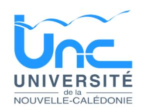

# 26-1470 - Profersseur agrégé ou certifié en Anglais

<a href="https://data.gouv.nc/explore/dataset/avis-de-vacances-de-poste-avp-drhfpnc/files/4142409b0ed621961de0e2e98ee99805/download/" target="_blank" style="display: inline-block; padding: 8px 16px; background-color: #3f51b5; color: white; text-decoration: none; border-radius: 4px;">📄 Télécharger le PDF original</a>

<!--

-->

## Un professeur agrégé ou certifié en Anglais

!!! success "📋 Candidature rapide"
    **Date limite :** 2026-10-30  
    **Direction :** UNC  
    **Domaine :** Autres filières  
    **Statut :** 📋 En cours

**Référence : 3134-26-1470/SR du 2026-10-09**

### Employeur : Université de la Nouvelle-Calédonie

**Corps ou Cadre d'emploi / Domaine :** Professeur agrégé ou certifié du cadre de l'enseignement du 2 nd degré de la Nouvelle-Calédonie ou du cadre Etat

**Poste à pourvoir :** Susceptible d'être vacant au 2027-02-01

**Direction :** Département des Sciences, Techniques et Santé

**Lieu de travail :** Nouméa - Campus de Nouville

**Date de dépôt de l'offre :** Vendredi 2026-10-09

**Date limite de candidature :** vendredi 2026-10-30

### Détails de l'offre 
L'Université de la Nouvelle-Calédonie est un établissement pluridisciplinaire qui répond notamment aux besoins de formation et de recherche propres à la Nouvelle-Calédonie. Elle veille à accompagner efficacement les évolutions de la Nouvelle-Calédonie et à répondre à ses besoins spécifiques.

Ancrée dans son environnement et sa région, l'UNC a pour ambition de promouvoir son activité de recherche sur la base de l'excellence et de la reconnaissance nationale et internationale. A ce titre, elle préside le CRESICA, consortium regroupant 9 organismes de recherche en Nouvelle-Calédonie, et co-porte avec l'University of South Pacific (Fidji) le PIURN, réseau des universités du Pacifique insulaire. Cette promotion passe par la mise en valeur de ses enjeux scientifiques, coordonnée au niveau local et régional, de ses capacités d'innovation et de transfert ainsi que par la qualité des formations qu'elle dispense.

L'UNC en chiffres, c'est 250 personnels, 3 500 étudiants, 3 départements de formation (Droit, Economie, Gestion ; Lettres, Langues, Sciences Humaines ; Sciences et Techniques), 1 IAE, 1 IUT, 1 INSPE, 1 CFA, 1 service de la formation continue, 3 unités de recherche, 2 UMR, 1 école doctorale.

L'UNC, c'est également deux campus dynamiques (Nouville en province Sud et Baco en province Nord), un campus connecté à Wallis-et-Futuna, des infrastructures modernes (learning centre, installations dédiées à la recherche et aux pédagogies innovantes (plateaux techniques, studio audiovisuel, Fablab, entrepreneuriat étudiant, etc.), des installations sportives de qualité, un accès privilégié à la vie culturelle et artistique et un environnement et une qualité de travail uniques.

L'UNC mène une politique académique et scientifique dynamique et reconnue. Elle est ainsi lauréate de plusieurs appels à projets (AAP) structurants pour l'établissement :

- AAP Nouveaux cursus à l'université, avec son projet TREC qui accompagne la réussite en licence avec la mise en place de parcours en 5 ou 7 semestres ;
- AAP Dispositifs territoriaux pour l'orientation vers les études supérieures, avec son projet CROSS qui porte des dispositifs innovants d'orientation du secondaire vers le supérieur ;
- AAP Accélération des stratégies de développement des établissements d'enseignement supérieur et de recherche, avec son projet StART UNC pour le développement de la formation professionnelle ;
- AAP ExcellencES, avec son projet DiversitES qui vise à transformer l'établissement en s'appuyant sur une signature, celle des diversités biologiques, culturelles et linguistiques ;
- AMI Compétences et Métiers d'Avenir, avec son projet AVENIR NC pour le développement de formations en lien avec la décarbonation de l'industrie. L'UNC porte également des actions dans le cadre de projets pilotés par le gouvernement de la Nouvelle-Calédonie :
- TRIAD, projet lauréat de l'AAP Plan Innovation Outre-Mer, qui vise à développer des systèmes alimentaires durables en Nouvelle-Calédonie ;
- Campus N, projet lauréat de l'AMI Compétences et Métiers d'Avenir, pour le développement des formations en lien avec la transition numérique.

L'UNC est enfin labellisée « SAPS » (Science Avec et Pour la Société) depuis 2024 grâce à son projet Nebelo, porté en collaboration avec plusieurs acteurs calédoniens, qui vise à rapprocher la science de la société par le biais d'un dialogue renforcé entre sciences exactes et sciences humaines et sociales et par des actions de médiations scientifiques à destination de tous les publics.

**Emploi RESPNC :** Enseignant du 2 nd degré

## 🎯 Missions

**Profil recherché** : Un emploi d'enseignant agrégé ou certifié en informatique est susceptible d'être à pourvoir à l'université de la Nouvelle-Calédonie à

| compter                           | du              | 1er             | février           | 2027.           | Une              | polyvalence     | est                    | globalement     |                          | attendue en     |
|-----------------------------------|-----------------|-----------------|-------------------|-----------------|------------------|-----------------|------------------------|-----------------|--------------------------|-----------------|
|                                   | enseignement    |                 | dans la           | licence         | Informatique     |                 | y compris              | le              | parcours                 | L3 MIAGE et     |
| le                                | Master          | MIAGE,          | avec              | une             | implication      |                 | à terme                | dans            | la                       | responsabilité  |
|                                   | pédagogique     | et              | la                | coordination    | des              | vacataires.     |                        |                 |                          |                 |
| Activités :                       |                 |                 |                   |                 |                  |                 |                        |                 |                          |                 |
| La                                | personne        |                 | recrutée          | interviendra    | au               |                 | département            | des             | Sciences,                | Techniques      |
| et                                | Santé           | au              | sein              | d'une           | petite           | équipe          |                        |                 | d'enseignants-chercheurs | en              |
|                                   | Informatique    |                 | complétée         | par             | des              | vacataires      |                        | professionnels. | Elle                     | assurera des    |
|                                   | enseignements   |                 | classiques        | de              | la licence       |                 | Informatique           | (y              | compris                  | le parcours     |
| MIAGE)                            | de              | niveau          | L1                | au niveau       | L3               |                 | (enseignements         | communs         |                          | aux licences    |
|                                   | d’informatique  |                 | et de             |                 | mathématiques).  |                 | La                     | personne        | recrutée                 | pourra          |
|                                   | notamment       |                 | intervenir        | sur des         |                  | enseignements   | de                     | mathématiques   |                          | appliquées à    |
|                                   | l’informatique, |                 |                   | d'algorithmique | et               |                 | programmation          |                 | en                       | Python, de      |
|                                   | programmation   |                 | orientée          | objet,          | de               | systèmes        |                        | d'exploitation, | de                       | réseaux, de     |
| génie                             | logiciel,       |                 | d’architecture    |                 | des              | ordinateurs,    | etc.                   | Elle            | pourra                   | animer et       |
|                                   | coordonner      | une             | équipe            |                 | d’enseignants    | vacataires.     | La                     | personne        |                          | recrutée pourra |
| aussi                             |                 | potentiellement |                   | intervenir      | en               | Master          | MIAGE.                 | Elle            | aura                     | également à     |
|                                   | s'impliquer     | dans            | l'encadrement     |                 | des              | projets         | tuteurés,              | et le suivi     | des                      | stages.         |
| Caractéristiques particulières de |                 |                 |                   |                 |                  |                 |                        |                 |                          |                 |
| l’emploi :                        |                 |                 |                   |                 |                  |                 |                        |                 |                          |                 |
| Le                                | candidat        | devra           | faire             | preuve          |                  | d'engagement    | dans                   | la vie          | de                       | l'université et |
|                                   | contribuer      | à son           |                   | rayonnement     | et à             | son             | développement.         |                 | Il est                   | notamment       |
| attendu                           | un              |                 | investissement    | dans            | les              | responsabilités |                        | pédagogiques    |                          | et dans la      |
|                                   | promotion       | des             | formations        | de              | l'établissement. |                 |                        |                 |                          |                 |
| Contact et informations           |                 |                 |                   |                 |                  |                 |                        |                 |                          |                 |
| complémentaires :                 |                 |                 |                   |                 |                  |                 |                        |                 |                          |                 |
| Mathieu                           |                 | BUFFET,         | directeur         | du              | département      |                 | des sciences,          |                 | techniques               | et santé :      |
| Nazha                             |                 |                 | SELMAOUI-FOLCHER, |                 |                  | référente       | disciplinaire          |                 |                          | informatique :  |
|                                   | Gwendoline      |                 | BOURHIS-PRIGENT,  |                 |                  | directrice      | des                    | ressources      |                          | humaines :      |
| Nima                              |                 | ABDILLAHI,      | pôle              | enseignants     | et               |                 | enseignants-chercheurs |                 | :                        |                 |

# POUR RÉPONDRE À CETTE OFFRE

Les dossiers de candidature en format pdf **aussi bien pour les fonctionnaires d'État que pour les fonctionnaires territoriaux** (pièce d'identité, curriculum vitae, lettre de motivation, copie du dernier arrêté de promotion, copie du dernier arrêté d'affectation, le cas échéant, justificatif de Reconnaissance de la Qualité de Travailleur Handicapé) sont à déposer directement dans GALAXIE/VEGA <https://galaxie.enseignementsup-recherche.gouv.fr/antares/can/index.jsp>

Toute candidature incomplète ne pourra être prise en considération.

Cet avis de vacance de poste est également consultable sur le site internet de l'Université de la Nouvelle-Calédonie : <https://unc.nc/utile/recrutement/recrutement-emplois-stages/>
---

## 🎯 Actions rapides

- 📄 [Télécharger le PDF original](#)
- ← [Retour à l'index](./)
- 💼 [Autres offres en Autres filières](../#autres-filieres)
- 🏢 [Toutes les offres DRHFPNC](./?direction=unc)

*[DRHFPNC]: Direction des Ressources Humaines de la Fonction Publique de Nouvelle-Calédonie
*[NC]: Nouvelle-Calédonie
