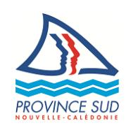

# 26-1498 - Intervenant des opérations de secours

<a href="https://data.gouv.nc/explore/dataset/avis-de-vacances-de-poste-avp-drhfpnc/files/6f1b1c5a1490a38c2111267893dabfcb/download/" target="_blank" style="display: inline-block; padding: 8px 16px; background-color: #3f51b5; color: white; text-decoration: none; border-radius: 4px;">📄 Télécharger le PDF original</a>

<!--

-->

**Référence : 3134-26-1498/SR du 2026-10-09**

### Employeur : Mairie de Nouméa

**Corps ou Cadre d'emploi / Domaine :** sapeur-pompier professionnel (C)

**Durée de résidence exigée**

**pour le recrutement sur titre :** /

**Poste à pourvoir :** novembre 2026

**Direction :** des services d'incendie et de secours **Service :** des centres de secours

**Lieu de travail :** Centre de secours

**Date de dépôt de l'offre :** vendredi 2026-10-09

**Date limite de candidature :** vendredi 2026-10-30

## Détails de l'offre 

!!! success "📋 Candidature rapide"
    **Date limite :** 2026-10-30  
    **Direction :** DRHFPNC  
    **Domaine :** Non-officiers  
    **Statut :** 📋 En cours

La ville de Nouméa et ses 1 500 collaborateurs sont engagés quotidiennement au service des 86 000 Nouméens. Ils œuvrent au développement de la Ville avec plus de 200 équipements et services en lien avec les nombreux domaines de compétence dévolus à la Commune.

Placée sous l'autorité directe du Secrétaire général en charge du pôle sécurité, la direction des services d'incendie et de secours est composée de plusieurs unités opérationnelles qui permettent la gestion des alertes (appel 18), le traitement des opérations, le secours aux personnes, la surveillance des plages ainsi que la protection des biens et de l'environnement. Son fonctionnement est organisé 24 heures sur 24 et 7 jours sur 7, au service de la population de la ville de Nouméa.

## 🎯 Missions

Il est notamment chargé de :

- Porter secours aux victimes ;
- Lutter contre les incendies ;
- Effectuer des opérations diverses ;
- Réceptionner et réguler les appels d'urgence et administratifs du service d'incendie et de secours ;
- Participer à l'ensemble des missions dévolues aux services d'incendie et de secours de la ville de Nouméa.

### Caractéristiques particulières de l'emploi 
- Travail fréquent en extérieur et par tous types de temps ;
- Environnement à risques majeurs ;
- Contrainte du lieu de résidence durant le temps de service en travail posté ;
- Aptitude physique et médicale (définies réglementairement) ;
- Horaires irréguliers (soirées, congés de fin de semaine, jours fériés) avec amplitude variable en fonction de l'organisation de l'activité opérationnelle ;
- Détenir les unités de valeur « Formation initiale d'équipier SPP ».

**Profil du candidat Savoir / Connaissance / Diplôme exigé :**

- Maîtrise des gestes de secours ;
- Connaissance des modalités opérationnelles ;
- Connaissance des équipements, matériels de protection individuelle de sauvetage et d'extinction ;
- Réglementations (guide national de référence, règlement opérationnel) ;
- Connaissance des attributions et compétences des personnels et des services associés aux secours ;
- Ce poste requiert un bon relationnel, de la rigueur, un bon sens de l'organisation et une grande maîtrise de soi dans les situations difficiles. Il

# POUR RÉPONDRE À CETTE OFFRE

Votre candidature doit **obligatoirement** comporter les documents suivants :

- Une lettre de motivation ;
- Un curriculum vitae (CV) détaillé ;
- La fiche de renseignements dûment complétée à [télécharger](https://drhfpnc.gouv.nc/sites/default/files/atoms/files/recrutement_-_fiche_de_renseignements_candidature_vf_0.pdf) ici (site DRHFPNC) ;
- L'attestation sur l'honneur de non bénéfice de la rupture conventionnelle à [télécharger](https://drhfpnc.gouv.nc/sites/default/files/atoms/files/attestation_sur_lhonneur_de_non_benefice_de_la_rupture_conventionnelle.pdf) ici (site DRHFPNC) ;
- La photocopie des diplômes ;
- Pour les fonctionnaires, l'arrêté de dernière situation administrative ;
- Les justificatifs concernant la citoyenneté ou la durée de résidence *si nécessaire* (liste des pièces à fournir dans le document "notice explicative" à [télécharger](https://drhfpnc.gouv.nc/sites/default/files/atoms/files/notice_explicative_emploi_local.pdf) ici (site DRHFPNC)) ;
- Pour les fonctionnaires, la demande de changement de corps ou cadre d'emploi *si nécessaire* (demande à [télécharger](https://drhfpnc.gouv.nc/sites/default/files/atoms/files/formulaire_de_changement_de_corps_ou_de_cadre_demploi.pdf) ici (site DRHFPNC)).

Votre candidature, précisant la référence de l'offre, doit parvenir au maire de la ville de Nouméa **prioritairement** par :

**- mail : [mairie.recrutement@ville-noumea.nc](mailto:mairie.recrutement@ville-noumea.nc)**

En cas d'impossibilité de candidater par le biais de la messagerie électronique, les dossiers de candidatures peuvent parvenir au maire de la ville de Nouméa par :

- Voie postale : BP K1 98849 Nouméa Cedex
- Dépôt physique : 16, rue du général Mangin Nouméa

*Les candidatures de fonctionnaires doivent être transmises sous couvert de la voie hiérarchique.*
---

## 🎯 Actions rapides

- 📄 [Télécharger le PDF original](#)
- ← [Retour à l'index](./)
- 💼 [Autres offres en Non-officiers](../#non-officiers)
- 🏢 [Toutes les offres DRHFPNC](./?direction=drhfpnc)

*[DRHFPNC]: Direction des Ressources Humaines de la Fonction Publique de Nouvelle-Calédonie
