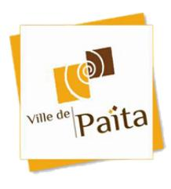

# 26-62725_MPRH - Vérificateur fiscalité immobilière

<a href="https://data.gouv.nc/explore/dataset/avis-de-vacances-de-poste-avp-drhfpnc/files/7831aa5a62f1997d9314aaa1c49749af/download/" target="_blank" style="display: inline-block; padding: 8px 16px; background-color: #3f51b5; color: white; text-decoration: none; border-radius: 4px;">📄 Télécharger le PDF original</a>

<!--

-->

## **Vérificateur fiscalité immobilière**

!!! success "📋 Candidature rapide"
    **Date limite :** 2026-05-07  
    **Direction :** DSF  
    **Domaine :** Autres filières  
    **Statut :** ⏳ **Cette semaine** (≤7 jours)

**Référence : 26-62725/MPRH du 2026-03-27**

## 🏢 Employeur

**Corps ou Cadre d'emploi /Domaine : attaché Direction des services fiscaux (DSF)**

**Service de la fiscalité immobilière**

**Durée de résidence exigée pour le recrutement sur titre (1) :**

**Lieu de travail :** Nouméa

**Date de dépôt de l'offre :** Vendredi 2026-03-27 **Poste à pourvoir :** vacant à partir du 2026-04-16

**Date limite de candidature :** Vendredi 2026-05-08

# **Modification de la date de clôture initialement prévue le 2026-04-17**

## Détails de l'offre :

La direction des services fiscaux, composée de treize services, est chargée d'asseoir, de contrôler et de recouvrer la plupart des impôts en vigueur en Nouvelle-Calédonie. Elle gère ainsi près de 76 % des recettes fiscales de la Nouvelle-Calédonie. Elle assure également une mission foncière, au travers de la gestion du domaine public et privé de la Nouvelle-Calédonie et de la publicité foncière, cette dernière ayant en charge notamment la taxe hypothécaire. Outre ces missions d'exécution, elle est en charge, dans le cadre de la politique poursuivie par le gouvernement de la Nouvelle-Calédonie, de l'élaboration de la législation fiscale ainsi que des mesures d'application.

Le service de la fiscalité immobilière et du patrimoine est chargé de contrôler la taxation des actes de mutation à titre gratuit (donations/succession) et onéreux (ventes/échanges), de surveiller les régimes de faveur en droits d'enregistrement (y compris en défiscalisation), d'évaluer les titres de sociétés non cotées et d'instruire les demandes d'agrément des opérations à caractère social.

**Emploi RESPNC :** Enquêteur

Sous l'autorité du chef de service, le vérificateur est chargé de veiller à ce que le **Missions :**

service assure les missions fixées par arrêté, en particulier contrôler les dossiers

en matière de mutations à titre gratuit (donations, successions).

**Activités principales :** - Vérifier les dossiers en matière de donations et successions, en particulier les

dossiers présentant des difficultés juridiques et fiscales complexes ; - Contrôler les dossiers en matière de mutations à titre onéreux ;

- Assurer le suivi des demandes d'assistances administratives.

**Activités secondaires :** - Participer à la veille juridique du service ;

- Participer à l'instruction et la rédaction des rescrits en droits d'enregistrement.

### **Profil du candidat** Savoir / Connaissances / Diplôme exigé :

- Maîtrise de la fiscalité et des procédures fiscales ;
- Formation d'inspecteur des impôts à l'Ecole Nationale des Finances Publiques appréciée ;
- Formation en droit privé ;
- Maîtrise du droit civil, en particulier droits de succession, régime matrimoniaux ;
- Notions en comptabilité commerciale ;
- Maîtrise de l'outil informatique.

#### Savoir-faire :

- Maitrise des procédures fiscales ;
- Bonnes qualités rédactionnelles et de synthèse.

#### Comportement professionnel :

- Méthode et sens de l'organisation ;
- Rigueur, esprit d'analyse et de synthèse ;
- Respect légal du secret professionnel ;
- Esprit d'initiative ;
- Sens du service public ;
- Autonomie ;
- Sens développé du travail en équipe ;
- Qualités d'écoute avec le contribuable et de tempérance et de cohérence avec les offices notariaux ;
- Bon relationnel intra et inter-services. (tact, équité et neutralité) et sens de la pédagogie ;
- Disponibilité.

**Contact et informations complémentaires :**

Mme Camille BARBAZAN, Cheffe du service de la fiscalité immobilière et du

patrimoine (SFIP)

Tél: [📞 25 76 49](tel:257649) / mail : *[✉️ camille.barbazan@gouv.nc](mailto:camille.barbazan@gouv.nc)*

**Informations salaire :** <https://drhfpnc.gouv.nc/sites/default/files/atoms/files/cag.pdf>

## **POUR RÉPONDRE À CETTE OFFRE**

Les candidatures (CV détaillé, lettre de motivation, photocopie des diplômes et fiche de renseignements, ainsi que la demande de changement de corps ou cadre d'emplois si nécessaire(2)) précisant la référence de l'offre doivent parvenir à **la direction des ressources humaines et de la fonction publique de Nouvelle Calédonie** par :

- voie postale : **B.P M2 - 98849 Nouméa cedex**

- dépôt physique : **Bureaux 106 et 107 - Section recrutement - DRHFPNC - Centre administratif Jacques Iékawé - 1er étage - 18 avenue Paul Doumer - Centre-ville de Nouméa**

- mail : **[✉️ drhfpnc.recrutement@gouv.nc](mailto:drhfpnc.recrutement@gouv.nc)**

(1)Vous trouverez la liste des pièces à fournir afin de justifier de la citoyenneté ou de la durée de résidence dans le document intitulé "Notice explicative : pièces à fournir pour justifier de votre citoyenneté ou de votre résidence" qui est à télécharger directement sur la page de garde des avis de vacances de poste sur le site de la DRHFPNC.

(2)La fiche de renseignements et la demande de changement de corps ou cadre d'emploi sont à télécharger directement sur la page de garde des avis de vacances de poste sur le site de la DRHFPNC. Toute candidature incomplète ne pourra être prise en considération.
---

## 🎯 Actions rapides

- 📄 [Télécharger le PDF original](#) {target="_blank"}
- ← [Retour à l'index](./)
- 💼 [Autres offres en Autres filières](../#autres-filieres)
- 🏢 [Toutes les offres DRHFPNC](./?direction=dsf)

*[DRHFPNC]: Direction des Ressources Humaines de la Fonction Publique de Nouvelle-Calédonie
*[MPRH]: Mission Politique de Ressources Humaines
