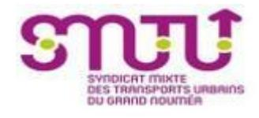

# 26-64552_MPRH - Gestionnaire SIRH

<a href="https://data.gouv.nc/explore/dataset/avis-de-vacances-de-poste-avp-drhfpnc/files/3e82b82f88022b8b97b58c62c65bcefd/download/" target="_blank" style="display: inline-block; padding: 8px 16px; background-color: #3f51b5; color: white; text-decoration: none; border-radius: 4px;">📄 Télécharger le PDF original</a>

<!--

-->

**Référence : 26-64552/MPRH du 2026-07-24**

## 🏢 Employeur

!!! success "📋 Candidature rapide"
    **Date limite :** 2026-08-14  
    **Direction :** DRHFPNC  
    **Domaine :** Autres filières  
    **Statut :** 📋 En cours

**Corps ou Cadre d'emploi /Domaine : rédacteur** ou **technicien /Informatique**

**Direction des ressources humaines et de la fonction publique de Nouvelle-Calédonie (DRHFPNC)**

**Service systèmes informatisés des ressources humaines**

### Durée de résidence exigée

**pour le recrutement sur titre (1) :** Technicien 1er ou 2ème grade domaine informatique : au moins égale à 10 ans.

**Lieu de travail :** NOUMEA

**Date de dépôt de l'offre :** Vendredi 2026-07-24

**Date limite de candidature :** Vendredi 2026-08-14

**Poste à pourvoir :** immédiatement

Le service des systèmes informatisés des ressources humaines (SIRH) est chargé d'offrir des outils de gestion des ressources humaines aux employeurs publics de la Nouvelle-Calédonie. Il assure les évolutions et la maintenance des SIRH Tiarhé, MPRH et téléservice concours ainsi que les outils qui lui sont interfacés avec pour objectif d'automatiser et dématérialiser les processus RH. Il assure un support de l'applicatif et métiers aux utilisateurs de la Nouvelle-Calédonie.

# Détails de l'offre 
Le gestionnaire SIRH joue un rôle clé de support et d'accompagnement auprès des utilisateurs des applicatifs du SIRH de la fonction publique de Nouvelle-Calédonie. Il assure un support de premier niveau, diagnostique et résout les incidents tout en veillant à l'amélioration continue des outils. Il analyse les besoins des services, identifie et conçoit les évolutions nécessaires en réponse aux contraintes réglementaires et aux enjeux opérationnels. Il contribue à la cohérence, à la qualité et à l'optimisation des applications afin de garantir leur bon fonctionnement et leur adéquation aux attentes des utilisateurs. **Missions : Activités principales :** o Répondre aux demandes des utilisateurs du SIRH via la hotline et leur apporter une assistance de premier niveau. o Contribuer au paramétrage et à la gestion des applications o Recueillir les besoins des utilisateurs et suggérer des améliorations pour optimiser les outils. o Collaborer avec les équipes techniques et fonctionnelles pour la mise en œuvre de nouvelles fonctionnalités. o Tester les nouvelles fonctionnalités et mises à jour du SIRH pour s'assurer de leur bon fonctionnement. o Assurer la formation et l'accompagnement des utilisateurs sur les bonnes pratiques d'utilisation du SIRH. o Veiller au respect de la confidentialité des données traitées au sein du service. **Activités secondaires :** o Contribuer à des projets mis en place au sein de la Direction

o Une expérience ou une familiarité avec le logiciel Tiarhé (HR Access) et les principes des Systèmes d'Information en Ressources Humaines (SIRH) est un

atout majeur.

o Connaissance souhaitée de la gestion des Ressources Humaines (paie, carrière, du recrutement et de la formation, ainsi que du déclaratif aux

organismes sociaux.)

o Aisance avec les outils informatiques, notamment avec l'extraction et le

traitement des données

o Intérêt pour les évolutions technologiques et les bonnes pratiques en matière

de gestion RH numérique.

## 🛠️ Savoir-faire

o Maîtriser le paramétrage et configuration des outils SIRH ;

o Compétence dans la création et l'exécution de requêtes pour extraire des

données pertinentes à partir de SIRH ;

o Aptitude à résoudre les problèmes des utilisateurs et à les accompagner dans

l'utilisation des outils ;

o Capacité à identifier les besoins émergents et à proposer des améliorations

adaptées ;

o Compétence d'animation et de conception de formations.

Comportement professionnel :

o Réactivité ; o Disponibilité ;

o Qualités relationnelles et aptitude au travail en équipe ;

o Diplomatie et capacité d'écoute ;

o Force de proposition ;

o Autonomie et gestion des priorités.

**Contact et informations complémentaires :**

Nadine Lespinasse, cheffe de service

Tél: [📞 25 61 67](tel:256167) / mail : *[✉️ nadine.lespinasse@gouv.nc](mailto:nadine.lespinasse@gouv.nc)*

**Informations salaire :** <https://drhfpnc.gouv.nc/sites/default/files/atoms/files/cag.pdf>

# POUR RÉPONDRE À CETTE OFFRE

- Voie postale : **B.P M2 98849 Nouméa cedex**
- Dépôt physique : **Bureaux 106 et 107 Section recrutement DRHFPNC Centre administratif Jacques Iékawé - 1er étage - 18 avenue Paul Doumer - Centre-ville de Nouméa**
- Mail : **[✉️ drhfpnc.recrutement@gouv.nc](mailto:drhfpnc.recrutement@gouv.nc)**

Les candidatures (CV détaillé, lettre de motivation, photocopie des diplômes et fiche de renseignements, ainsi que la demande de changement de corps ou cadre d'emplois si nécessaire(2)) précisant la référence de l'offre doivent parvenir à **la direction des ressources humaines et de la fonction publique de Nouvelle Calédonie** par :

(1)Vous trouverez la liste des pièces à fournir afin de justifier de la citoyenneté ou de la durée de résidence dans le document intitulé "Notice explicative : pièces à fournir pour justifier de votre citoyenneté ou de votre résidence" qui est à télécharger directement sur la page de garde des avis de vacances de poste sur le site de la DRHFPNC.

(2)La fiche de renseignements et la demande de changement de corps ou cadre d'emploi sont à télécharger directement sur la page de garde des avis de vacances de poste sur le site de la DRHFPNC.

Toute candidature incomplète ne pourra être prise en considération.
---

## 🎯 Actions rapides

- 📄 [Télécharger le PDF original](#)
- ← [Retour à l'index](./)
- 💼 [Autres offres en Autres filières](../#autres-filieres)
- 🏢 [Toutes les offres DRHFPNC](./?direction=drhfpnc)

*[DRHFPNC]: Direction des Ressources Humaines de la Fonction Publique de Nouvelle-Calédonie
*[MPRH]: Mission Politique de Ressources Humaines
*[RH]: Ressources Humaines
*[SIRH]: Système d'Information de Gestion des Ressources Humaines
